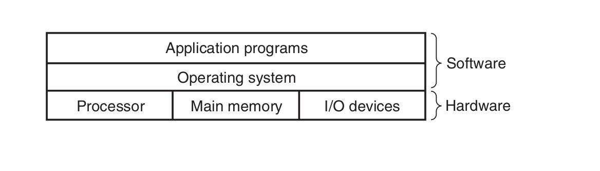
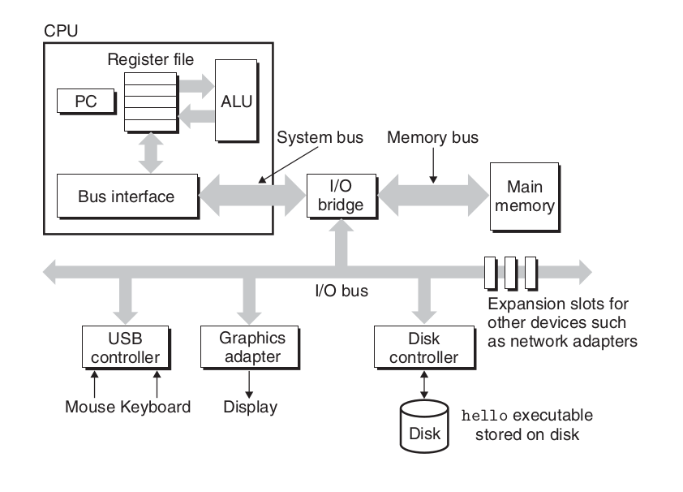
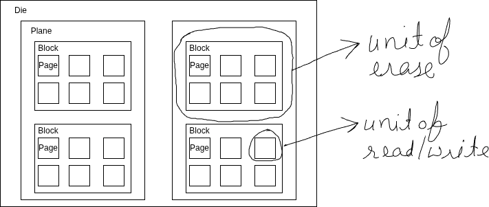

---
delivery date:
---
---
### System overview

#### Layered architecture

 
Image credits: CSAPP

---
#### Hardware overview


Image credits: CSAPP

---

**Buses** are like nervous system of the computer. Data moves from one place to another via buses. Buses are charecterized by word size as well as bits that can be transfered in a given time.

---

**IO devices** are what connects a computer to external world. It"s like humans have 5 senses, computer has IO devices. 4 key IO devices that we will concern ourselves with are:   
	1. Display: out device through which computer talks back with the user.  
	2. Keyboard/mouse: input device through which computer listens to the user  
	3. Storage device: This is the long term storage that computer has. All programs initially lies here.   

---

**Main memory** is the area where program is loaded when it is to be run and it stays there while it"s being executed. Think of it like short term memory in humans. Any task in ordered to be done should inside our memory.

---

**Processor** is where results and addresses are computed in the program. It has 3 main parts:  
1. Program counter  
2. registers   
3. ALU(Arithmetic and Logical unit)   

---
#### Memory hierarchy

##### Storage devices
1. **Random Access Memory**
	1. Static RAM(SRAM) is used for cache memories, both on and off the CPU chip.
	2. DRAM(Dynamic RAM) is used for the main memory plus the frame buffer of a graphics system.
2. **HDD(Magnetic Storage)** use spinning magnetic platters to store data. A read/write head moves over the platters to read or write data. 
3. **Solid state disks(SSD)** store data on interconnected flash memory chips that retain data even when powered off. 

---
##### Memory hierarchy and Cache
The storage devices in every computer system are organised as a memory hierarchy. As we move from the top of the hierarchy to the bottom, the devices become slower, larger, and less costly per byte.

The main idea of a memory hierarchy is that *storage at one level serves as a cache for storage at the next lower level*. Thus, the register file is a cache for the L1 cache. Caches L1 and L2 are caches for L2 and L3, respectively. The L3 cache is a cache for the main memory, which is a cache for the disk.
```bash
lscpu | grep cache;getconf -a | grep CACHE
```

---

Image credits: CSAPP

---
##### Caching

- Hardware : Registers, L1, L2, L3  act as cache for main memory.   
- Operating system: Main memory acts as cache for disc while implementing virtual memory.  
- Application programs: Browser cache recently accessed web pages for faster loading. 

---
##### Locality principles
Cache leads to improved performance because of following principles:

**Temporal locality:**  a memory location that is referenced once is likely to be referenced again multiple times in the near future.  
**Spatial locality:**  if a memory location is referenced once, then the program is likely to reference a nearby memory location in the near future.


---
##### Relative latencies
  
Image credits:  [relative-time-latencies-and-computer-programming](https://alvinalexander.com/photos/relative-time-latencies-and-computer-programming/)

---

#### Disk access

##### HDD vs SSD


Image credits: [Backblaze](https://www.backblaze.com/blog/ssd-vs-hdd-future-of-storage)

Total Read Time = **Seek time  + Rotational latency (HDD only)  + Transfer time (sequential read)**


| Pattern              | HDD                | SSD        |
| -------------------- | ------------------ | ---------- |
| **Sequential read**  | Excellent          | Excellent  |
| **Random read**      | Terrible           | Acceptable |
| **Seek cost**        | Dominant           | None       |
| **Throughput**       | High if sequential | High       |
| **Latency variance** | Huge               | Small      |


##### HDD Semantics (Magnetic Storage)


Image credits: [Medium](https://medium.com/@youssefshibl000/database-internals-chapter-2-b-tree-basics-ffa4983afa8c)

Units of Operation

* **Sector:** The Sector is the atomic unit for Reading, Writing, and Overwriting.


* **Reads:** Mechanical seek + rotation
* **Writes:** In-place overwrite (old data is destroyed)
* **Deletes:** Metadata-only; data remains until overwritten
* **Bottleneck:** Seek time (milliseconds)

Implications:

* Data layout matters enormously
* [Fragmentation](https://en.wikipedia.org/wiki/File_system_fragmentation) hurts performance
* Defragmentation helps

---

##### SSD Semantics (NAND Flash)



SSDs are governed by a **write–erase asymmetry**.

Units of Operation

-  **Page:** Smallest read/write unit (4KB–16KB)
- **Block:** Smallest erase unit (multiple pages, often MBs)

One-Way Writes  
- Cells start erased (`1`)  
- Writes flip bits to `0`  
- You **cannot flip `0 → 1` without erasing the entire block**

---

##### Out-of-Place Updates (Copy-on-Write)

Because pages cannot be overwritten:
* Updates are written to **new pages**
* Old pages are marked **stale**
* Physical data moves over time  

This applies to:

* File edits
* Database updates
* Metadata changes

---

##### Flash Translation Layer (FTL)

The FTL is firmware running inside the **SSD controller**.

Its responsibilities:

* Map **logical block addresses (LBAs)** to **physical pages**
* Perform wear leveling
* Handle garbage collection
* Hide flash complexity from the OS

Key insight:

> Logical addresses are stable; physical locations are not.

---

##### Garbage Collection & Write Amplification

Because stale pages accumulate:

* SSDs periodically **copy live pages**, erase blocks, and reuse them
* This background work causes **Write Amplification (WA)**

Example:

* App writes 4KB
* SSD internally moves 12KB
* WA = 3×

Implications:

* Random writes increase WA
* Sequential writes reduce GC overhead
* SSD lifetime and performance depend heavily on write patterns

---

##### TRIM and Deletes

* **HDD delete:** Metadata-only
* **SSD delete:** Requires **TRIM** so the SSD knows data is invalid

Without TRIM:

* SSD assumes deleted data is still live
* GC becomes inefficient
* Performance degrades over time


---
## References

1. [CSAPP, Chapter 1](https://csapp.cs.cmu.edu/)
2. [Database Internals, Chapter 2](https://www.databass.dev/)
3. [Log-structured file systems: There's one in every SSD [LWN.net]](https://lwn.net/Articles/353411)