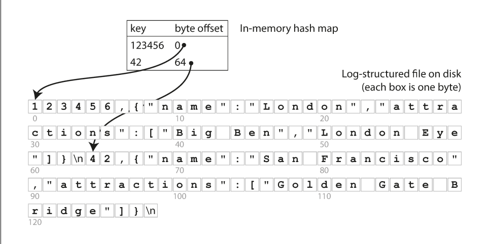

---
delivery date:
  - "[[2026-01-13]]"
  - "[[2026-01-16]]"
  - "[[2026-01-20]]"
  - "[[2026-01-22]]"
---
## Quick recap
- Data Engineer: skills and responsibilities
- Data Engineering lifecycle

---
## Agenda
- Storage engines
	- Log based storage
	- Hash indexes
---
## Why study storage internals?

- To pick right tools for your use case
- To be able to tune the configurations of storage engine as per your requirements

---
## Storage engine overview

| Property                 | Transaction processing systems(OLTP)                  | Analytics processing(OLAP)                |
| ------------------------ | ----------------------------------------------------- | ----------------------------------------- |
| **Primarily used for**   | End user/customer, via web application                | Internal analyst, for decision support    |
| **What data represents** | Latest state of data (current point in time)          | History of events that happened over time |
| **Dataset size**         | Gigabytes to terabytes                                | Terabytes to petabytes                    |
| **Main write pattern**   | Random-access, low-latency writes from user input     | Bulk import (ETL) or event stream         |
| **Main read pattern**    | Small number of records per query, fetched by key     | Aggregate over large number of records    |
| **Implementation types** | - Log structured database<br>- B tree based databases | - Columnar storage                        |


--- 
# Log based storage 

Refer [code](../code/storage_engines/log_based_main.py)

A log is an **append-only sequence of records**. It doesn’t have to be human-readable; it might
be binary and intended only for other programs to read.


```bash
#!/bin/bash
db_set () {
	echo "$1,$2" >> database
}

db_get () {
	grep "^$1," database | sed -e "s/^$1,//" | tail -n 1
}
```


| Pros                                                           | Cons                                                                             |
| -------------------------------------------------------------- | -------------------------------------------------------------------------------- |
| - Faster writes since appending to a file is a cheap operation | - Read complexity is O(n) since each read requires us to <br>read the whole file |

---

# Log based storage + hash indexes 

Refer [code](../code/storage_engines/log_based_main_hashmaps.py)

**Key idea:** Along with appending to the log file maintain a in-memory hashmap that acts as a signpost to the actual keys.



Image credits: Designing Data-Intensive Applications

### Implementation details:
- **How do we avoid running out of disk space?**:
  *via compaction*: Process of timely removing the duplicates from segment file. 
- **File format:** CSV is not the best format for a log. It’s faster and simpler to use a binary format
that first encodes the length of a string in bytes, followed by the raw string
(without need for escaping).
- **How to delete record?** If you want to delete a key and its associated value, you have to append a special
deletion record to the data file (sometimes called a tombstone). When log segments are merged, the tombstone tells the merging process to discard any previous values for the deleted key.
- **Crash recovery**:
	- Read all segment and regenerate hash map on service restart(painful if we have large segment files)
	- Maintain hashmap on disk also and read it into memory on restart.
- **Concurrency:** One write thread, multiple read thread


## Tradeoffs

**Pros:**

- Appending and segment merging are **sequential write operations**, which are generally **much faster than random writes**, especially on magnetic spinning-disk hard drives.  
- Concurrency and crash recovery are much simpler if segment files are append-only or immutable.  
- Merging old segments avoids the problem of data files getting fragmented over time  

**Cons:**

- Hash table must fit into main memory. so if you have a very large number of keys, you’re out of luck.  
- Range queries are not efficient. For example, you cannot easily scan over all keys between kitty00000 and kitty99999—you’d have to look up each key individu‐
ally in the hash maps.  
---

# References
1. [Chapter 1, Computer Systems: A Programmer's Perspective(CSAPP)](https://csapp.cs.cmu.edu/)
2. Chapter 3, Designing Data intensive Applications
3. [Bitcask - A Log-Structured fast KV store](https://arpitbhayani.me/blogs/bitcask)
