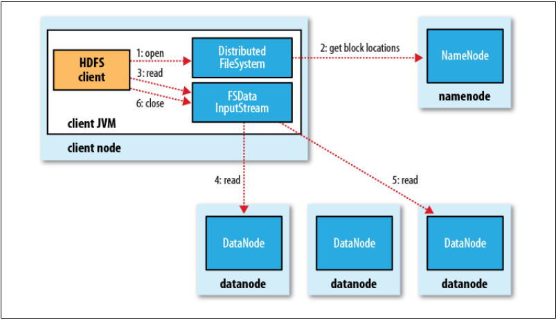
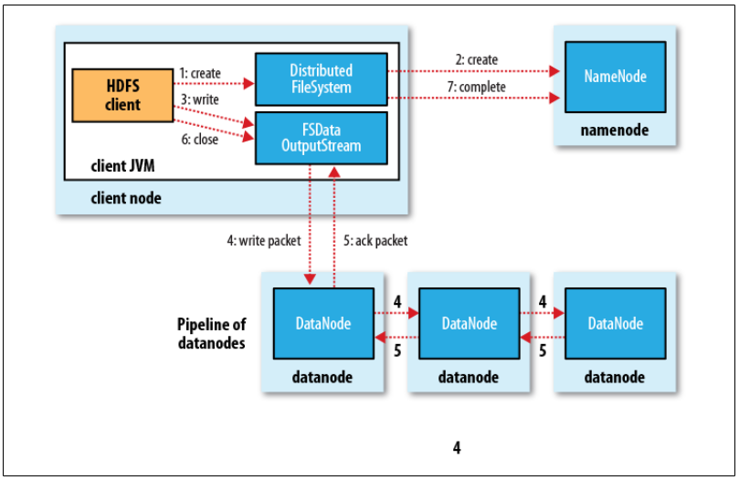
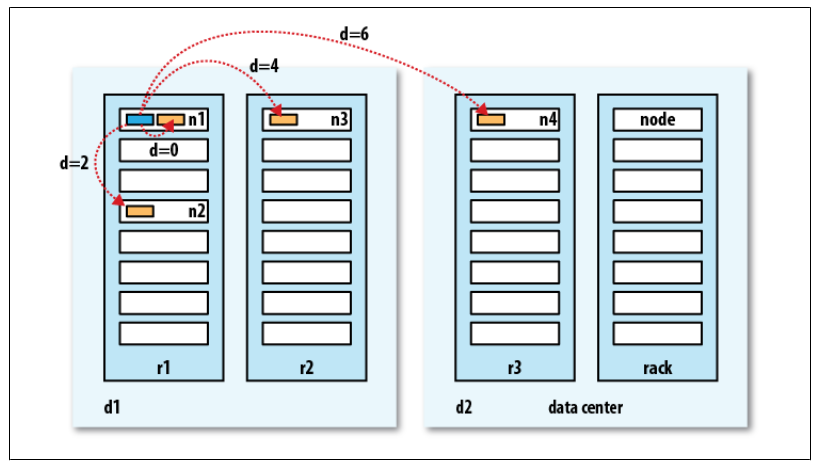

---
date:
  - "[[2026-02-17]]"
---

## Local Filesystem 
A filesystem is a method and data structure that an operating system uses to manage and organize files on a storage device such as a hard drive, SSD, or USB flash drive.  
Eg: ext3, ext4, ntfs, fat32  

Related commands/utilities: `gparted`

---
## Data vs Metadata
**Inode:** It is a data structure that stores metadata about a file or a directory, except for its name and actual data content.   When you create a file, the filesystem allocates an inode and assigns it an inode number.  
- **Unique Identification**: Each inode has a unique number within the filesystem, called the inode number.  
- **Mapping**: filenames => inode numbers. When you access a file by name, the filesystem looks up the inode number in the directory.    

```bash
	stat file.txt
```

---
## Hard links vs softlinks

| Feature                 | Hard Link               | Soft Link             |
| ----------------------- | ----------------------- | --------------------- |
| Points to               | Inode                   | Path                  |
| Can link to directories | No                      | Yes                   |
| Deleting original file  | Data remains accessible | Link becomes broken   |
| Filesystem limitations  | Same filesystem only    | Can cross filesystems |

Related commands:

```bash
ln -s source_file target_file # creates soft link
ln source_file target_file # creates soft link
```

---
## Files are stored in blocks
### **What Is a Disk Block?**
At the lowest level, a hard disk (or SSD) does **not read individual bytes**.
It reads and writes in **fixed-size chunks** called:
> **Disk blocks** (also called sectors)

**Typical Sizes**
- HDD traditional sector: **512 bytes**
- Modern drives (Advanced Format): **4 KB**
- SSD internal pages: often 4KB or larger
You cannot read 1 byte from disk.  
You must read at least one block.

Each block is:
- Addressable
- Fixed size
- Atomic unit of IO

### Why use blocks?
1. *Efficiency*
	Disk hardware is optimized for:
	- Reading contiguous regions
	- Not individual bytes
 2. *Addressing Simplicity*
	Instead of storing:
> 	File occupies bytes 123–456
	Filesystem stores:
> 	File uses blocks:> 18, 19, 20
	Much simpler mapping.

## Summary
- Directories organize namespace.  
- Inodes organize metadata.  
- Blocks store data.  
- Physical placement is an implementation detail.

## Distributed Filesystems

#### The Block Strategy

- **Size:** Defaulting to 64 MB or 128 MB, blocks are the atomic unit of storage.  
- **Separation:** A file's blocks need not reside on the same disk or machine, allowing files to exceed the size of any single disk in the cluster.  
- **Replication:** To handle fault tolerance, every block is replicated (default factor: 3) across physically separate machines. If a node fails, the system transparently replicates lost blocks from remaining copies

#### Architecture: Master/Worker Pattern
- **Namenode (The Master):** Manages the filesystem namespace and metadata (file tree, permissions) entirely in memory. It tracks which Datanodes hold which blocks, but it does _not_ persistently store block locations; these are reconstructed from Datanode reports upon startup.  
    - _Scalability constraint:_ The number of files is limited by the Namenode's memory.   
    - _Reliability:_ The Namenode is a Single Point of Failure (SPOF). High Availability (HA) configurations use an Active-Standby pair with shared edits to mitigate this.          
- **Datanodes (The Workers):** Responsible for storing and retrieving blocks as instructed by the client or Namenode.
#### Data Flow and Coherency

**The Read Path:** Clients contact the Namenode to get block locations (sorted by network proximity) and then retrieve data directly from the Datanodes. This separates control traffic from data traffic, preventing the Namenode from becoming a bottleneck.


Image credits: [Hadoop : the definitive guide](https://opac.daiict.ac.in/cgi-bin/koha/opac-detail.pl?biblionumber=24428 )


**The Write Path (Pipeline):** Writes are pipelined. The client writes packets to an internal queue; data flows from Client $\to$ Datanode A $\to$ Datanode B $\to$ Datanode C. An acknowledgment packet must return from all nodes in the pipeline before the write is considered successful.

Image credits: [Hadoop : the definitive guide](https://opac.daiict.ac.in/cgi-bin/koha/opac-detail.pl?biblionumber=24428 )

**Coherency Model:**
HDFS sacrifices some POSIX coherency for performance.
- A file being written is not immediately visible to other readers.
- Data becomes visible only when a full block is written or when the `sync()` method is explicitly called.
- Closing a file performs an implicit sync.
### Network Topology (Rack Awareness)

Hadoop utilizes a tree topology to calculate "distance" (bandwidth cost). Distance is calculated as the sum of distances to the closest common ancestor.   
- _Write Placement Policy:_ To balance reliability and bandwidth, the default strategy places replica 1 on the local node, replica 2 on a different rack, and replica 3 on a different node in the same remote rack.

Bandwidth  between two nodes is used as a measure of distance.  
The idea is that the bandwidth available for each of the following scenarios becomes progressively less: 
```
Processes on the same node > Different nodes on the same rack >  Nodes on different racks in the same data center > Nodes in different data centers
```



---
## References
1. [Chapter 3, Hadoop : the definitive guide by White, Tom](https://opac.daiict.ac.in/cgi-bin/koha/opac-detail.pl?biblionumber=24428 )
