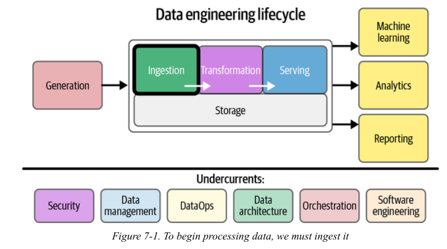
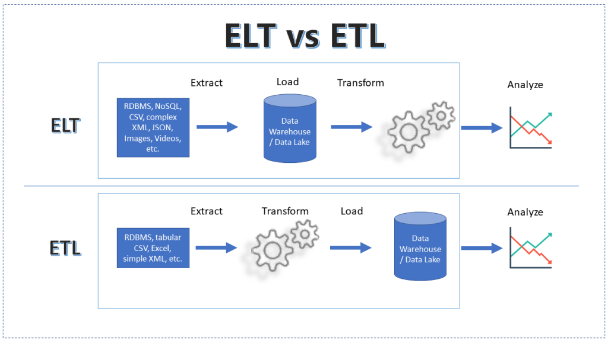
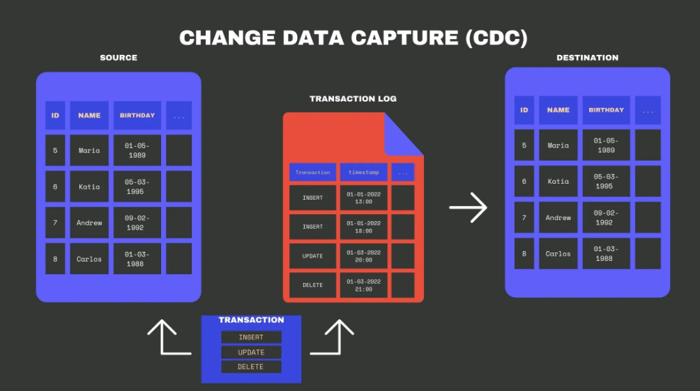

  
  
Image credit: Fundamentals of Data Engineering  
  
Data ingestion implies data movement from source systems into storage in the data engineering lifecycle, with ingestion as an intermediate step.  
## Key considerations  
### 1. What’s the use case for the data I’m ingesting?  
  
The **same data** is ingested very differently depending on the use case.  
**Examples**  
1. Case A: Analytics dashboard  
	- Data: Orders  
	- Need: Daily revenue  
	- Approach:  
	    - Batch ingestion (hourly/daily)  
	    - ELT is fine  
2. Case B: Fraud detection  
	- Data: Transactions  
	- Need: Detect fraud in seconds  
	- Approach:  
	    - Streaming + CDC  
	    - Low latency (< seconds)  
  
---  
### 2. Can I reuse data instead of ingesting duplicates?  
Teams often create **multiple pipelines for same data**  
  
**Example:**  
**Bad architecture ❌**  
```text  
DB → Pipeline A → Warehouse  
DB → Pipeline B → Dashboard DB  
DB → Pipeline C → ML system  
```  
  
- Same data ingested 3 times  
- Inconsistent versions 😱  
**Good architecture ✅**  
```text  
DB → CDC → Central Stream → Multiple consumers  
```  
**Note**  
> “Ingestion should happen once. Distribution happens downstream.”  
  
**Real-world failure**  
- Metrics mismatch between teams  
- “Why is revenue different in dashboard vs ML model?”  
---  
  
###  3. Where is the data going? (Destination)  
  
**Why this matters:**  
  
Destination determines:  
- Schema  
- Format  
- Latency  
- Transformations  
**Examples:**  
  
| Destination      | Ingestion Style | Notes           |  
| ---------------- | --------------- | --------------- |  
| Data warehouse   | Batch / ELT     | Structured      |  
| Search engine    | Stream          | Needs indexing  |  
| ML feature store | Both            | Needs freshness |  
| Dashboard        | Pre-aggregated  | Fast queries    |  
  
Same data (orders):  
- Warehouse → raw + SQL transforms  
- Dashboard → aggregated table      
- Kafka → event stream  
**Note**  
> “Design ingestion backwards from the destination.”  
---  
### 4. How often should data be updated?  
  
**Tradeoff:**  
Freshness vs Cost  
  
**Examples:**  
Low frequency (batch)    
- HR data → daily    
- Reports → hourly    
High frequency (streaming)      
- Payments → real-time    
- Notifications → instant    
  
**Note**  
> “Not all data needs to be real-time.”  
  
**Anti-pattern**  
  
> “Let’s use Kafka for everything” ❌  
---  
### 5. What is the expected data volume?  
**Why this matters**  
Volume determines:  
- Tooling (Kafka vs cron job)  
- Storage cost  
- Partitioning strategy  
  
  
**Examples:**  
 **Small scale**  
- 10K rows/day  
- Use simple cron + SQL  
 **Large scale**  
- 1M events/sec  
- Need:  
    - Kafka  
    - Partitioning  
    - Distributed systems  
  
 **Note**  
> “Scale changes architecture—not just hardware.”  
  
 **Failure case**  
- Pipeline works in testing      
- Crashes in production due to volume spike  
  
---  
###  6. What format is the data in?  
  
**Why this matters:**  
  
Format affects:  
- Speed  
- Compatibility  
- Schema evolution  
Examples  
  
 *JSON*  
  
```json  
{ "user": 1, "order": 42 }  
```  
	- Easy  
	- Human-readable  
	- Large size  
  
 *Protobuf / Avro*  
- Compact  
- Faster  
- Needs schema  
  
  
  Scenario  
  
 API ingestion  
- JSON → easy  
 High-throughput streaming  
- Protobuf → efficient  
  
 **Note**  
> “Format is a contract between producers and consumers.”  
  
**Failure**  
- Schema mismatch → pipeline breaks  
---  
  
### 7. Is data clean? What are data quality risks?  
  
 Reality  
> Raw data is _always messy_  
  
  
**Examples**  
**Example:** 1: Bot traffic  
- Website logs inflated  
- Fake clicks  
  
**Example:** 2: Missing values  
  
```text  
user_id = NULL  
```  
  
**Example:** 3: Duplicates  
- Same event ingested twice  
  
 **Solutions**  
- Deduplication  
- Validation rules  
- Filtering bots  
 **Note**  
> “Garbage in → garbage everywhere.”  
  
  Real-world impact  
- Wrong business decisions  
- Misleading dashboards  
---  
  
### 8. Do we need in-flight processing? (Streaming case)  
  
 Meaning  
Processing data **while it is moving**  
  
---  
  
**Example:**  
  
**Example:** 1: Fraud detection  
```text  
Transaction → check rules → flag immediately  
```  
  
---  
**Example:** 2: Notifications  
  
```text  
Order placed → send notification instantly  
```  
**Example:** 3: Aggregations  
```text  
Clicks → count per minute → dashboard  
```  
  
**Without in-flight processing**  
  
```text  
Store → later process → too late ❌  
```  
**With in-flight processing**  
```text  
Stream → process → act immediately ✅  
```  
**Note**  
  
> “Streaming is about reacting, not storing.”  
  
### Scenario: Food Delivery App  
  
| Question    | Answer                           |  
| ----------- | -------------------------------- |  
| Use case    | Real-time tracking + analytics   |  
| Reuse       | CDC → Kafka → multiple consumers |  
| Destination | Warehouse + Notifications        |  
| Frequency   | Real-time + hourly batch         |  
| Volume      | High (orders, clicks)            |  
| Format      | JSON → Protobuf later            |  
| Quality     | Remove bots, deduplicate         |  
| In-flight   | Yes (notifications, ETA updates) |  
  
---  
##  ETL vs. ELT  
  
Image credit: ChatGPT  
**The Core Concept:** The difference is not just the order of operations, but **where the compute happens.**  
  
A. ETL (Extract, Transform, Load) - _The Traditional Way_  
- **Workflow:** Data is extracted $\rightarrow$ transformed in a separate **staging server** (using Spark, Informatica, etc.) $\rightarrow$ loaded into the Data Warehouse.  
- **Why use it?** When the target system is slow/expensive or when sensitive data (PII) must be masked _before_ it lands.  
- **Downside:** The transformation layer is a bottleneck. If the business requirements change, you have to re-ingest the raw data.  
  
B. ELT (Extract, Load, Transform) - _The Modern Way_  
- **Workflow:** Raw data is loaded directly into the Data Warehouse/Lake $\rightarrow$ transformed using the **target’s own compute** (e.g., SQL in Snowflake or BigQuery).  
- **Why use it?** Storage is cheap; Cloud Data Warehouse compute is massively parallel.  
- **The "dbt" Factor:** Mention that ELT is the foundation of the "Analytics Engineer" role.  
  
| **Feature**     | **ETL**                 | **ELT**               |  
| --------------- | ----------------------- | --------------------- |  
| **Compute**     | External Engine         | Target Warehouse      |  
| **Flexibility** | Rigid (Fixed Schema)    | High (Schema-on-read) |  
| **Data Volume** | Better for small/medium | Built for Big Data    |  
  
---  
##  Change Data Capture: The "Delta" Strategy  
  
  
Image credit: [Change Data Capture (CDC): Definition, Methods, and Benefits](https://airbyte.com/blog/change-data-capture-definition-methods-and-benefits)  
**The Problem:** We cannot do a "SELECT *" on a 10TB production database every hour. It would crash the DB and waste bandwidth.  
  
A. How CDC Works  
CDC identifies and captures insertions, updates, and deletions in source tables so that only the **changes** are moved.  
  
B. Two Primary Approaches:  
1. **Query-based (Poll):** Checking a `last_updated` timestamp column.  
    - _Flaw:_ It misses hard deletes and adds load to the source DB.  
2. **Log-based (Push):** Reading the Database **Transaction Log** (e.g., MySQL Binlog, Postgres WAL).  
    - _Benefit:_ Zero impact on DB performance; captures every single intermediate state of a row.  
C. The CDC-to-Warehouse Pipeline  
- **Tooling Example:** Debezium is the industry standard for turning DB logs into event streams.  
  
---  
  
## Bridge: From Tables to Events   
**The Shift:** Moving from "State" to "History."  
  
- **The Table view (State):** "User X lives in Gandhinagar." (This is what you see in a DB).  
- **The Event view (Log):**  
    1. User X created account.  
    2. User X added address: Ahmedabad.  
    3. User X updated address: Gandhinagar.  
  
 Key Conceptual Takeaway:  
- **A Table is a snapshot of the Log at a point in time.**  
- **A Log is the source of truth.**  
- **Introduction to Message Queues:** If CDC turns a database into a stream of events, we need a "buffer" to hold those events before they are processed. This is where **Kafka** enters.  
  
  
## References  
1. Chapter 7 Fundamentals of Data Engineering   
2. [Change Data Capture (CDC): Definition, Methods, and Benefits](https://airbyte.com/blog/change-data-capture-definition-methods-and-benefits)  