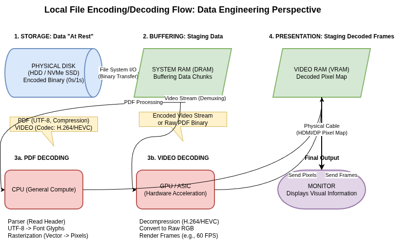
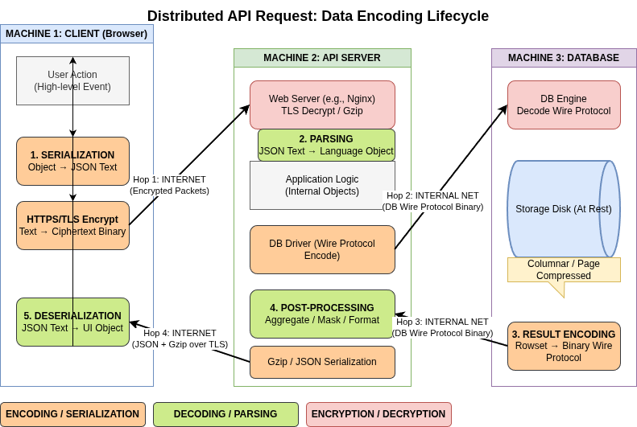

## Data Encoding and Evolution

## Examples of data movement

### The Imperative of Compatibility

Applications are rarely static; they change due to new features, shifting user requirements, or business circumstances. In large-scale systems, code changes cannot happen instantaneously. Instead, they occur via:

- Rolling Upgrades: Staged rollouts where new versions are deployed to a few nodes at a time to ensure stability and avoid downtime.
- Client-Side Delays: Inability to force users to update mobile or desktop applications immediately.

These scenarios necessitate a system where old and new versions of code, and old and new data formats, coexist.

### Core Compatibility Definitions

|Type|Definition|Implementation Complexity|
|---|---|---|
|**Backward Compatibility**|Newer code can read data written by older code.|Generally straightforward; newer code knows the old format.|
|**Forward Compatibility**|Older code can read data written by newer code.|Trickier; requires older code to ignore additions made by newer versions.|

--------------------------------------------------------------------------------

### Analysis of Encoding Formats

Data exists in two representations: in-memory (optimized for CPU access via pointers) and encoded (a self-contained sequence of bytes for storage or network transmission).

1. Language-Specific Formats

Many languages have built-in serialization (e.g., Java’s java.io.Serializable, Python’s pickle). These are generally discouraged for long-term use because:

- They are often tied to a single programming language.
- Security Risks: Decoding can allow the instantiation of arbitrary classes, leading to remote code execution.
- Inefficiency: Performance and encoding size are often neglected.

1. Textual Formats: JSON, XML, and CSV

These are widespread and human-readable but possess subtle technical flaws:

- Numerical Ambiguity: JSON does not distinguish between integers and floating-point numbers, leading to precision loss for numbers greater than 2^{53} (e.g., Twitter tweet IDs require workaround decimal strings).
- Binary Support: Lack of support for binary strings requires "hacky" Base64 encoding, which increases data size by 33%.
- Schema Complexity: While XML and JSON have schema languages, they are often complicated to implement and learn.

1. Binary Encodings for JSON and XML

Formats like MessagePack or BSON provide a binary representation of the JSON/XML data model. However, because they are schemaless, they must still include all object field names within the encoded data.

- Example Performance: A record that takes 81 bytes in textual JSON takes 66 bytes in MessagePack. The modest space reduction may not always justify the loss of human readability.

--------------------------------------------------------------------------------

### Schema-Based Binary Encodings

Thrift, Protocol Buffers (protobuf), and Avro use schemas to achieve high compression and strict evolution rules.

#### Thrift and Protocol Buffers

Both use field tags (integer aliases) instead of field names to identify data.

- Evolution Mechanism: New fields can be added if they are given new tag numbers. Old code ignores unknown tags (forward compatibility), and new code can read old data as long as tags aren't repurposed (backward compatibility).
- Constraint: You can never change a field's tag. New fields added after deployment must be optional or have default values to maintain backward compatibility.
- Efficiency: Thrift’s CompactProtocol and Protocol Buffers use variable-length integers to pack data tightly (e.g., the same 81-byte JSON record is reduced to ~33-34 bytes).

Apache Avro

Avro is distinct because it does not use field tags. It is designed for Hadoop-scale data and focuses on a "Writer's Schema" and a "Reader's Schema."

- Schema Resolution: The reader examines the writer's schema and the reader's schema side-by-side, matching fields by name.
- Dynamic Schemas: Avro is friendlier to dynamically generated schemas (e.g., dumping a relational database). If a database column is added, a new Avro schema is generated, and the resolution logic handles the mapping.
- Compactness: Because it lacks tags and field names, Avro is the most compact format (the sample record is reduced to 32 bytes).

--------------------------------------------------------------------------------

### Modes of Dataflow

#### Dataflow Through Databases

In databases, "data outlives code." Records may remain in their original encoding for years while the application code changes around them.

- Preservation of Unknown Fields: If an older version of the code reads a record written by a newer version, modifies it, and writes it back, it must preserve the new fields it does not recognize to prevent data loss.
- Migrations: While relational databases allow simple schema changes (e.g., adding a column with a null default), rewriting large datasets is expensive and avoided where possible.

#### Dataflow Through Services: REST and RPC

- REST: A design philosophy building on HTTP. It emphasizes simple data formats, URLs, and standard HTTP features. It is the predominant style for public APIs due to its broad tool support and ease of debugging.

- RPC (Remote Procedure Call): Aims to make a remote network request look like a local function call (location transparency).
  
  - The RPC Flaw: Unlike local calls, network requests are unpredictable, can timeout, and have variable latency.
  - Modern Frameworks: gRPC, Thrift, and Finagle are more explicit about these differences, using futures/promises to encapsulate asynchronous actions.

#### Message-Passing Dataflow

Asynchronous message passing (via brokers like RabbitMQ or Kafka) sits between RPC and databases.

- Advantages: Acts as a buffer for unavailable recipients, allows one-to-many delivery, and decouples the sender from the recipient.
- Actor Model: A concurrency model where logic is encapsulated in actors that communicate via asynchronous messages. Distributed actor frameworks (like Akka or Orleans) integrate message brokers into the programming model to scale across nodes.

--------------------------------------------------------------------------------

## References

1. Chapter 4, Designing Data Intensive Applications
