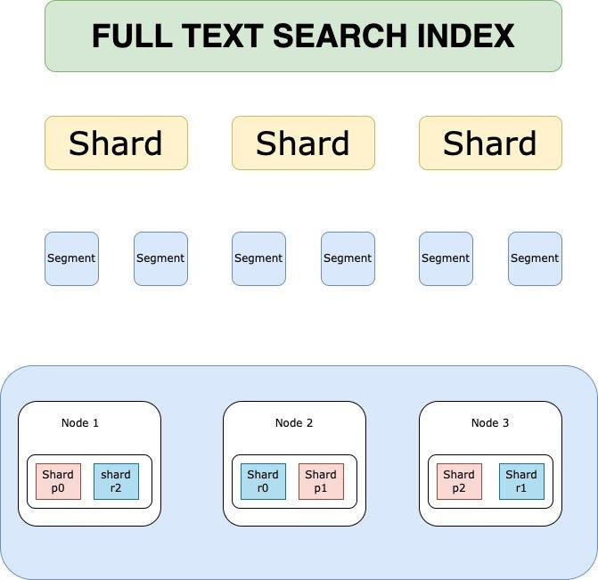

## Elasticsearch Replication

When comparing MySQL replication to Elasticsearch/OpenSearch replication, the key shift is from **"replaying SQL logs"** to **"replicating operations and building index structures independently."**

Unlike MySQL, Elasticsearch does **not copy segment files during normal operation**. Instead, it replicates indexing operations, and each node builds its own internal index.

---

### 1. The Core Concept: Primary and Replica Shards

  
Source: ChatGPT

In Elasticsearch, an index is split into **Shards**.

- **Primary Shard ($P0$):** Handles all write operations for that shard.

- **Replica Shards ($R0, R1, R2$):** Receive replicated operations and serve read requests.

---

### 2. The Replication Mechanism (How it works)

When a write operation is sent:

1. **Primary Shard:**

    - Applies the operation (index/update/delete)

    - Writes to in-memory buffer and transaction log (translog)

2. **Replication:**

    - The operation (not segment files) is forwarded to Replica Shards

3. **Replica Shards:**

    - Apply the same operation independently

    - Build their own Lucene segments

4. **Acknowledgment:**

    - Depends on configuration (e.g., required active shards)

5. **Refresh (Background):**

    - Makes data searchable (default ~1 second)

**Key Insight:** Replication is **operation-based**, not file-copy-based (segment copying only occurs during recovery or rebalancing).

---

### 3. Why Replicas?

#### A. Read Scalability

Queries are distributed across Primary + Replica shards in parallel.

#### B. High Availability

If a Primary fails:

- A Replica is promoted automatically

#### C. Search Performance

Replicas improve throughput and reduce query latency.

---

### 4. Write Consistency

Elasticsearch uses configurable acknowledgment settings:

- **Default Behavior:**

  - Primary must succeed

  - Replicas may also be required depending on `wait_for_active_shards`

- **Stronger Durability:**

  - Wait for one or more replicas before acknowledging

- **Weaker Durability:**

  - Acknowledge after primary only (faster, risk of data loss)

There is no strict quorum protocol like Raft; consistency is configurable rather than enforced via majority consensus.

---

### 5. Rebalancing

- **New Node Joins:** Shards are redistributed automatically.

- **Node Failure:**

  - Replica promoted to Primary

  - Missing replicas rebuilt in background

---

### 6. OpenSearch Specifics

- Enhanced self-healing and cluster management

- Strong open-source ecosystem

- Kubernetes-native deployments via operators

### Tradeoffs/Best practices

#### 1. Know Your Workload (Always First)

- Define:
      - Queries/sec, indexing rate, data growth
      - Query types (filters vs full-text vs aggregations)
- Expect **2–3 iterations** before optimal design

**Tradeoff:**

- Overestimate → wasted resources
- Underestimate → reindexing + scaling pain

---

#### 2. Number of Shards

- Each shard = **single-threaded query execution**
- Parallelism = across shards, not within shard

**Guideline:**

- Target **20–40 GB per shard** (typical sweet spot)
- Avoid:
      - Too many tiny shards (<1 GB)
      - Too few huge shards (>50–100 GB)

**Tradeoffs:**

- **More shards**

      - Higher parallelism
      - − More overhead (CPU, memory, scheduling)
- **Fewer shards**

      - Lower overhead
      - − Reduced parallelism, slower large queries

**Rule:** Benchmark with real workload.

---

#### 3. Number of Replicas

- Max replicas ≤ (nodes − 1)
- Default = 1 (good baseline)

**Use more replicas when:**

- Read-heavy workload
- Small dataset (can fit on each node)

**Tradeoffs:**

- **More replicas**
      - Higher query throughput
      - Better availability
      - − More disk + memory usage
      - − Higher cluster coordination cost
- **Fewer replicas**
      - Lower cost
      - − Reduced fault tolerance and read scaling

---

#### 4. Number of Nodes

- Minimum:
  - **3 master-eligible nodes** (avoid split brain)
- Prefer:
  - Dedicated master nodes (no data role)

**Scaling rule:**

- More data → more data nodes
- Keep shard size in target range

**Tradeoffs:**

- **More nodes**

  - - Better distribution, fault tolerance
  - − Higher coordination overhead
- **Fewer nodes**
  - - Simpler cluster
  - − Risk of overload, poor resilience

---

#### 5. Number of Indexes

- Focus on **total shard count**, not index count

**Best practice:**

- Prefer **fewer, larger indexes**
- Avoid many tiny indexes/shards

**Tradeoffs:**

- **Many small indexes**
      - − High overhead, inefficient
- **Fewer consolidated indexes**
      - Better performance, resource usage

---

#### Quick Heuristics (Practical Defaults)

- Shard size: **20–40 GB**
- Replicas: **1 (increase for read-heavy)**
- Masters: **3 dedicated nodes**
- Avoid: **too many small shards**
- Always: **benchmark with real queries**

---

### Core Mental Model

- Shards = **parallelism unit**
- Replicas = **read scaling + availability**
- Nodes = **capacity + fault tolerance**

Optimizing a cluster = balancing these three.

## Mysql replication

MySQL replication is a powerful mechanism that allows you to copy database changes from a **Primary server** (formerly called Master) to one or more **Replica servers** (formerly called Slaves).

Here is a comprehensive overview of what you need to know about how MySQL handles replication, ranging from the basic architecture to modern best practices.

---

### 1. The Core Mechanism: Binary Logging

The foundation of replication is the **Binary Log** (`binlog`). Think of this as a database journal that records every data change (INSERT, UPDATE, DELETE) in chronological order.

- **How it works:** The Primary server records every change in its Binary Log.

- **The Task:** The Replica server periodically connects to the Primary and asks, "What changes have you made since the last time we spoke?"

- **Storage:** The Primary does not send the actual data; it sends the log entries (events).

---

### 2. The Replication Process (IO and SQL Threads)

MySQL uses a "Two-Thread" architecture to ensure replication doesn't slow down writing to the database.

1. **The I/O Thread:**

    - Runs on the **Replica**.

    - Connects to the Primary and reads the Binary Log events.

    - **Keeps a local copy:** It stores these events in a file on the Replica called the **Relay Log**.

    - _It is asynchronous_, meaning the Primary does not pause while waiting for the Replica to save the log.

2. **The SQL Thread:**

    - Runs on the **Replica**.

    - Reads the events from the Relay Log.

    - **Executes the SQL:** It applies the changes to the Replica's data files just as if a user had typed the commands.

---

### 3. Types of Replication (Latency vs. Safety)

The most critical decision you make is how "strong" the connection between Primary and Replica is.

- **Asynchronous Replication (Classic):**

  - The Primary does not wait for confirmation from the Replica before confirming a transaction to the client.

  - _Pros:_ Lowest latency.

  - _Cons:_ If the Primary crashes before the Replica receives the update, data may be lost.

- **Semi-Synchronous Replication:**

  - The Primary waits until **at least one** Replica has received the log event and synced it to its relay log before acknowledging the transaction.

  - _Pros:_ Reduces probability of data loss.

  - _Cons:_ Does not completely eliminate data loss (e.g., if the acknowledged replica fails before applying the transaction).

- **Group Replication:** (Advanced)

  - A distributed replication scheme using **certification-based conflict detection**.

  - Supports **multi-primary** setups (multiple nodes can accept writes).

  - Transactions are checked for conflicts before commit, and conflicting transactions may be rolled back.

---

### 4. Binlog Formats

MySQL can record changes in three ways. The format on the Primary must match the expectations of the Replica (unless using Mixed mode).

1. **Statement-Based (SBR):**

    - Records the exact SQL statement (e.g., `UPDATE users SET age = 20 WHERE id = 1`).

    - _Pros:_ Logs are smaller; easier to debug.

    - _Cons:_ **Non-Deterministic.** If a function like `NOW()` returns different values on different servers, data will diverge.

2. **Row-Based (RBR):**

    - Records the actual changed data (e.g., `Row id=1 changes to age=20`).

    - _Pros:_ Most accurate; works with non-deterministic functions.

    - _Cons:_ Binary logs can be very large.

3. **Mixed-Based (MBR):**

    - MySQL automatically chooses Statement or Row based on the query.

    - _Note:_ This is commonly used in modern deployments.

---

### 5. Global Transaction Identifiers (GTIDs)

GTIDs are the modern way to manage replication.

- **What is it?** Every transaction is assigned a unique ID composed of server ID + sequence number.

- **Advantage:** Simplifies failover and replication topology management; eliminates manual tracking of file/position.

- **Note:** Helps prevent issues like missing or duplicate transactions ("GTID holes") in complex setups.

---

### 6. Common Use Cases

- **Read Scaling (Load Balancing):** Distribute read queries to replicas while writes go to the primary. Note that replicas may serve **stale reads** due to replication lag.

- **Failover:** Maintain a standby replica that can be promoted if the Primary fails.

- **Data Archiving:** Offload historical or analytical workloads to replicas.

---

### 7. Crucial Considerations & Risks

- **Replication Lag:** Replicas can fall behind the Primary. This breaks **read-after-write consistency**.

- **Data Divergence:** Manual writes on replicas or inconsistent environments can cause drift.

- **Replication is not Backup:** Corrupted or deleted data will replicate as well.

- **Read-Only Mode:** Set `read_only = 1` on replicas to prevent accidental writes.

- **Network Latency:** High latency increases lag and can cause backlog buildup.

- **Failover Risks:** Improper failover can lead to split-brain scenarios or data inconsistencies.

---

### Summary Table: Replication

|Feature|MySQL Replication|Elasticsearch/OpenSearch Replication|
|:--|:--|:--|
|**Mechanism**|Binary Log (logical changes)|Operation-based replication|
|**The "Writer"**|Primary DB|Primary Shard|
|**Replication Unit**|SQL/row events|Indexing operations|
|**Execution Model**|Replay logs|Re-execute operations|
|**Search Visibility**|Immediate|Near real-time (refresh-based)|
|**Failure Handling**|Manual/managed failover|Automatic promotion|
|**Consistency**|Eventual (async by default)|Configurable (NRT model)|

---

### Mental Model Shift

```
MySQL → logical replication (replay intent via logs)
Elasticsearch → operational replication (replay operations, build index independently)
```
