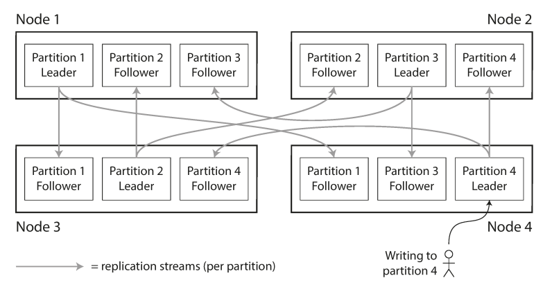
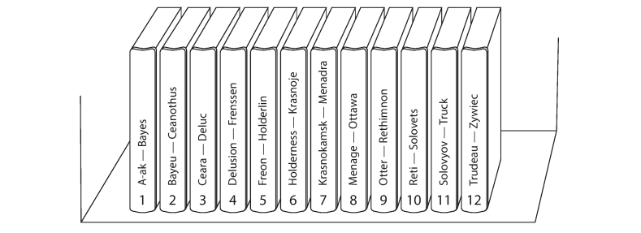
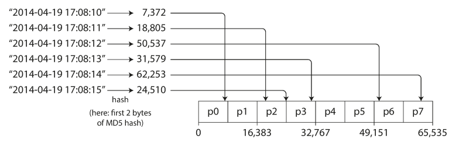
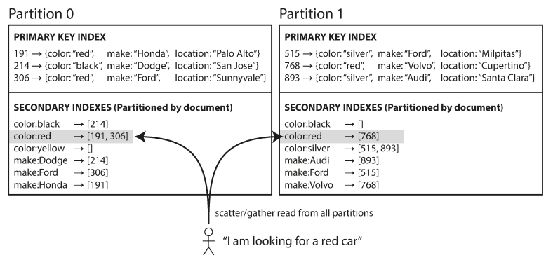
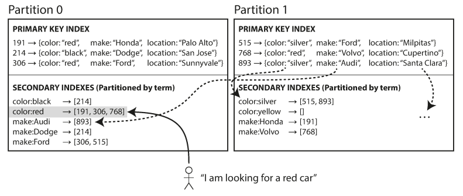
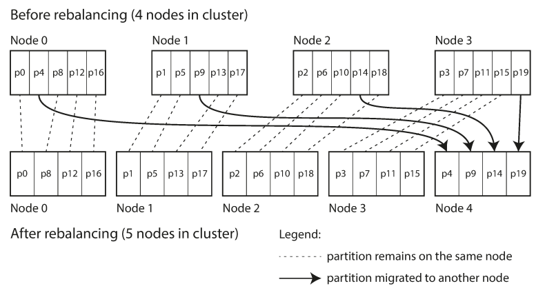

# Fundamentals of Partitioning

**Partitioning** is a fundamental technique for scaling datasets that are too large to be stored or processed on a single machine. In a partitioned database, every record belongs to exactly one partition, effectively creating multiple "small databases."

  
Source: Designing Data-Intensive Applications

    **Q and A**

    - If I partition data across 3 nodes, do I have 3 copies or 1 copy split into 3?
    - How is this different from replication?
    - What kind of problem does partitioning solve that vertical scaling cannot?

---

## Industry Terminology

While "partitioning" is the established term, various database systems use different nomenclature:

| System | Term Used |
| :--- | :--- |
| MongoDB, Elasticsearch, SolrCloud | Shard |
| HBase | Region |
| Bigtable | Tablet |
| Cassandra, Riak | vnode |
| Couchbase | vBucket |

## Core Objectives

- Scalability: By placing different partitions on different nodes in a shared-nothing cluster, data can be distributed across many disks and query loads across many processors.
- Query Throughput: For queries operating on a single partition, nodes can execute tasks independently, allowing throughput to scale linearly by adding more nodes.
- Parallelism: Large, complex queries can be parallelized across multiple nodes, though this increases implementation complexity.

    **Q and A**
  - Which of these benefits breaks if queries need data from multiple partitions?
  - Can partitioning ever hurt performance?

---

## Partitioning Strategies for Key-Value Data

The method of deciding which records are stored on which nodes is critical to avoiding skew (unfair partitioning) and hot spots (disproportionately high load on a single partition).  

1. **Partitioning by Key Range**

      
    Source: Designing Data-Intensive Applications

    This method assigns a continuous range of keys to each partition, similar to volumes of a paper encyclopedia.

    - **Advantages:** Supports efficient range scans. Keys can be treated as concatenated indexes to fetch related records in a single query.
    - **Disadvantages:** High risk of hot spots for certain access patterns. For instance, if the key is a timestamp, all writes for "today" will hit the same partition, overloading it while others remain idle.
    - Systems: Bigtable, HBase, RethinkDB, and early versions of MongoDB.

    **Q and A**

    - Why does timestamp-based partitioning create hot spots?”
    - Can you think of real-world data that would cause this issue?
    - Would adding more machines fix this problem?

1. **Partitioning by Hash of Key**  
      
    Source: Designing Data-Intensive Applications

    To combat skew, many systems use a hash function to determine the partition for a given key. A good hash function (such as MD5 or Fowler–Noll–Vo) takes similar input strings and returns evenly distributed numbers across a range.

    - **Advantages:** Distributes keys fairly among partitions, even with skewed input data.
    - **Disadvantages:** Sort order is lost, making range queries inefficient. In systems like MongoDB, range queries in hash-sharded mode must be sent to all partitions.
    - **Hybrid Approaches:** Cassandra uses a compound primary key where only the first part is hashed to determine the partition, while subsequent columns are used to sort data within the partition. This allows efficient range scans if a fixed value is provided for the first column.

1. **Managing Skewed Workloads**  
    Even with hashing, "celebrity" keys (e.g., a social media user with millions of followers) can cause hot spots. Applications must often mitigate this manually, such as by appending a random two-digit decimal to the end of a hot key to split writes across 100 different partitions. This necessitates additional bookkeeping and "scatter/gather" logic for reads.

    **Q and A**

    - Why doesn’t hashing fully solve hot spots?
    - What is the cost of appending random suffixes?
    - What happens to reads when writes are split across partitions?

---

## Partitioning and Secondary Indexes

Secondary indexes do not identify a record uniquely but allow searching for occurrences of specific values. They do not map neatly to partitions, leading to two primary implementation strategies:

**Document-Partitioned Indexes (Local Indexes):**

  
Source: Designing Data-Intensive Applications

In this model, each partition maintains its own secondary index for the documents it contains.

- **Writes:** Highly efficient; only the partition containing the document needs to be updated.
- **Reads:** Requires "scatter/gather" querying—the client must send the query to all partitions and combine the results. This is prone to tail latency amplification.
- **Used by:** MongoDB, Riak, Cassandra, Elasticsearch, and SolrCloud.

**Term-Partitioned Indexes (Global Indexes):**

  
Source: Designing Data-Intensive Applications  

A global index covers data across all partitions but is itself partitioned to prevent bottlenecks.

- **Writes:** Slower and more complex; a single document write may require updating multiple partitions of the global index.
- **Reads:** More efficient; the client only needs to contact the partition containing the specific term (e.g., color:red).
- **Consistency:** Updates are often asynchronous due to the complexity of distributed transactions.
- Used by: Amazon DynamoDB, Riak (Search), and Oracle data warehouses.

---

## Rebalancing Partitions

Rebalancing is the process of moving data and requests between nodes to accommodate changes in query throughput, dataset size, or machine failures.

**Rebalancing Requirements**

- Load must be shared fairly after rebalancing.
- The database must remain available for reads and writes during the process.
- Data movement should be minimized to reduce network and disk I/O load.

## Technical Strategies

- **Fixed Number of Partitions:** Create significantly more partitions than nodes (e.g., 1,000 partitions for 10 nodes). When a node is added, it "steals" partitions from existing nodes. The mapping of keys to partitions remains static; only the assignment of partitions to nodes changes.
      
    Source: Designing Data-Intensive Applications

- **Dynamic Partitioning:** Used primarily for key-range partitioning. When a partition exceeds a size threshold (e.g., 10 GB), it splits; when it shrinks, it merges with an adjacent partition. (Used by HBase, RethinkDB).
- **Partitioning Proportional to Nodes:** The number of partitions is a fixed multiple of the number of nodes. When a new node joins, it randomly splits existing partitions to take ownership of half. (Used by Cassandra).

    **Q and A**
  - Which strategy minimizes data movement?
  - Which one is easiest to implement?
  - Which one would fail badly under uneven growth?

**Operational Considerations:**

While fully automated rebalancing is convenient, it can be dangerous. Automatic failure detection combined with automatic rebalancing can trigger cascading failures if an overloaded node is mistakenly identified as "dead," causing the remaining cluster to move its load and further saturate the network and remaining nodes.

---

## Request Routing and Service Discovery

As partitions move between nodes, systems must determine where to route specific requests. There are three primary high-level approaches to this "service discovery" problem:

1. **Round-Robin/Forwarding:** Clients contact any node. If the node doesn't own the partition, it forwards the request to the correct node.
2. **Routing Tier:** A partition-aware load balancer (routing tier) determines the correct node and forwards the request.
3. **Client Awareness:** Clients maintain the partition-to-node mapping and connect directly to the appropriate node.

**Coordination Mechanisms:**

Many systems (HBase, SolrCloud, Kafka) use an external coordination service like ZooKeeper to maintain the authoritative mapping and notify actors of changes. Others, like Cassandra and Riak, use a gossip protocol to disseminate cluster state changes among nodes, avoiding external dependencies.

---

## References

- Designing Data-Intensive Applications - Chapter 6: Partitioning
