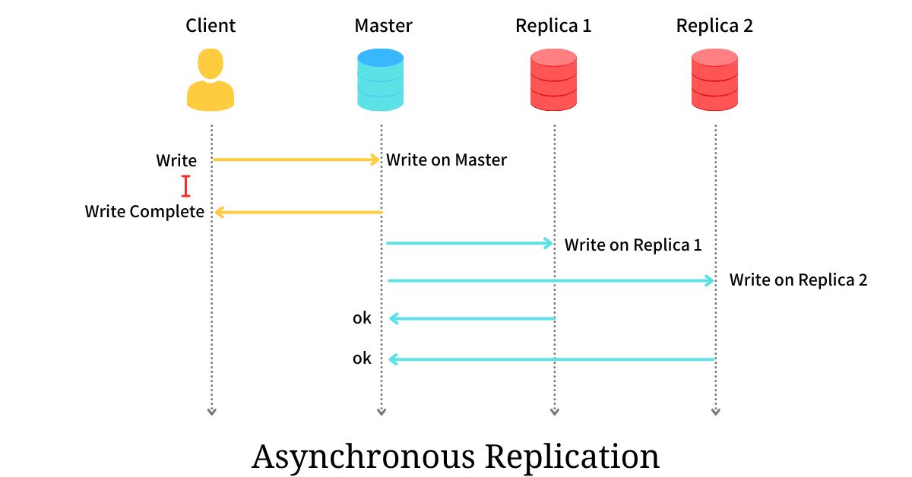
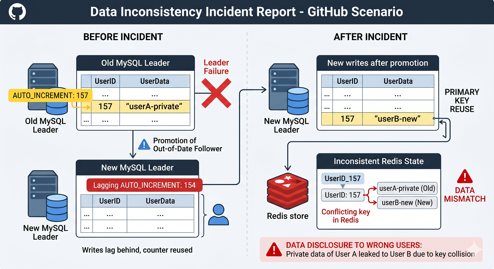
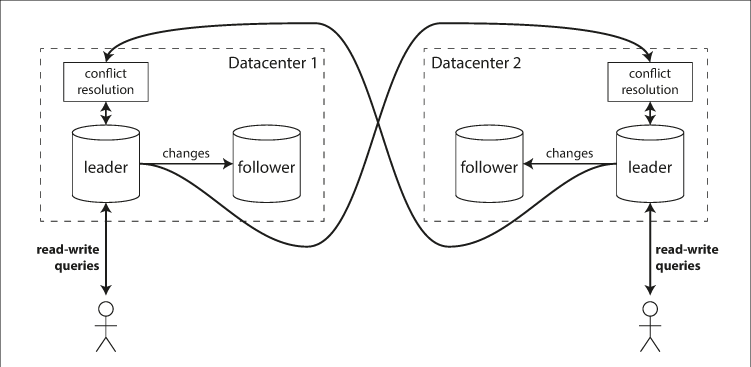
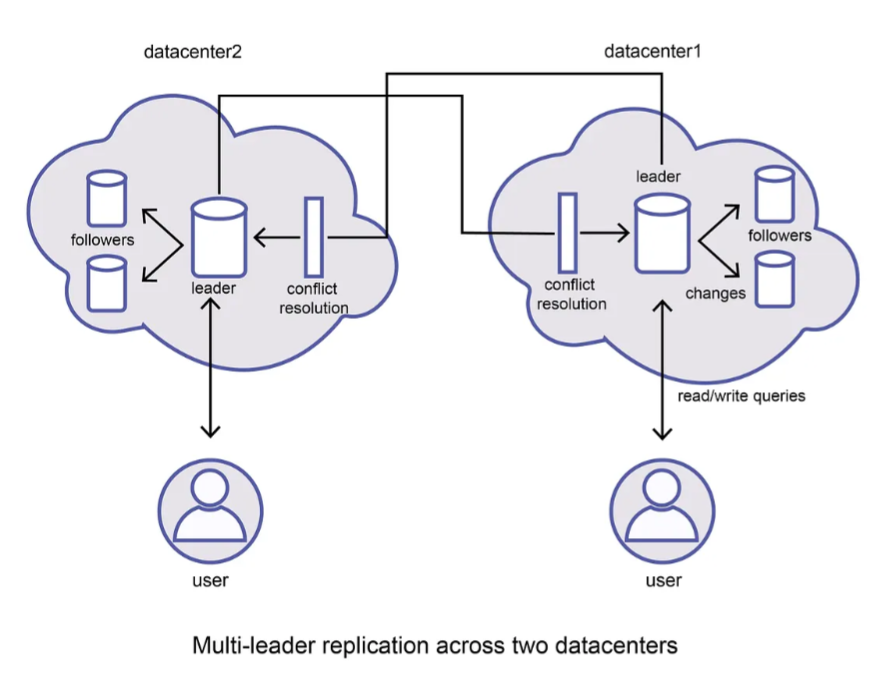
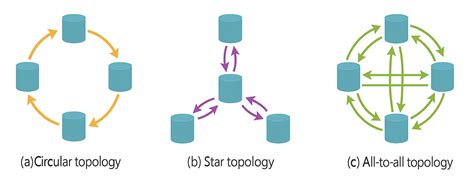
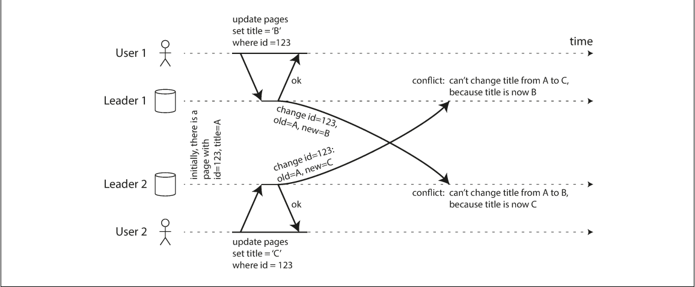
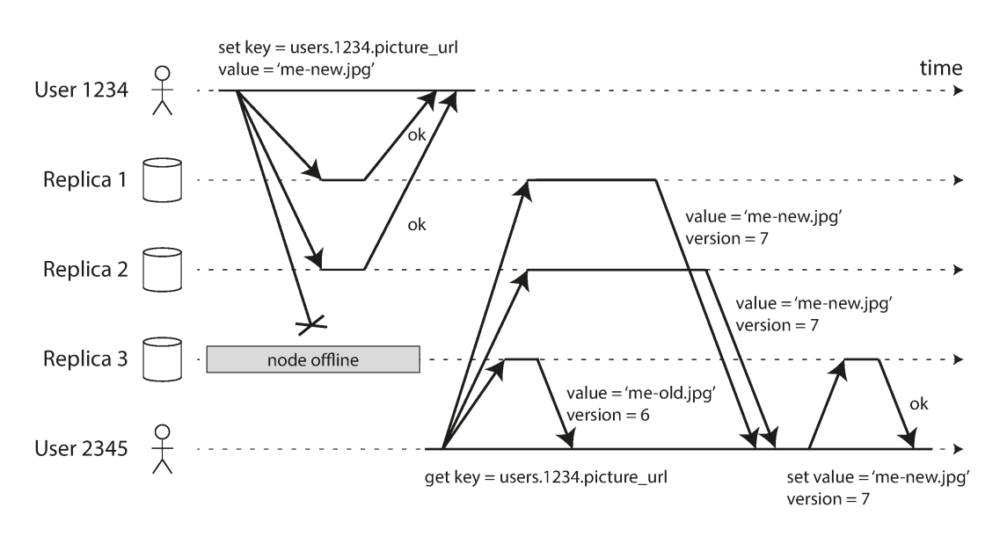
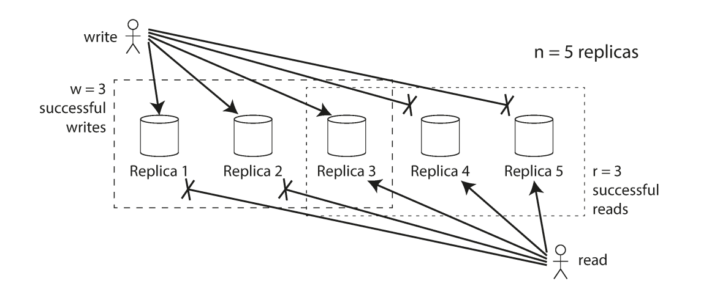

## Why scaling up doesn't work


1. **The Physical I/O Limit (The "Waiting" Trap)**
 Even if you put the fastest CPU in the world into a single server, the database process will eventually start **waiting**.

    * **Disk I/O:** Databases (especially storage-intensive ones) often run at 100% CPU utilization but still run slowly because the storage system cannot keep up. In a single monolithic machine, the CPU and storage are connected by a finite bus (PCIe). If the SSD's write speed is 5GB/s, no amount of CPU power will make the database run faster than 5GB/s.
    * **Network I/O:** If your application needs to handle 100 million requests a second, sending them to a single machine means that machine needs to handle the network stack of 100 million machines. A single NIC (Network Interface Card) has a bandwidth limit.

1. **The Hypervisor Overhead**
 If you are using virtualization (AWS EC2, Azure VMs, VMware), scaling up is constrained by the virtualization layer.

    * **Paravirtualization Drivers:** To make VMs perform like bare metal, hypervisors require specific drivers. There is a constant battle between the Guest OS and the Host for control of hardware.
    * **vCPU/DRAM Allocation:** Cloud providers limit you to specific configurations (e.g., "High Memory" instances).
      * *Constraint:* You can easily scale out to add 10 shards and let Kubernetes handle the overhead.
      * *Constraint:* You cannot "add" RAM to a hypervisor arbitrarily. You must upgrade to an entirely different, much larger instance tier, which might cost 10x more.

1. **Single Point of Failure (SPOF)**

    * **Availability Risk:** Scaling up maximizes the damage of a failure. If you put your entire business on the world’s largest single computer, that computer is a **Single Point of Failure** (SPOF). If a capacitor blows, the router drops, or a hypervisor host fails, **everyone** goes down simultaneously.
    * *Replication Logic:* This is why replication is important. If you have 5 smaller machines, one can fail, and your system stays up.

1. **The Economic Ceiling**

    * There are diminishing returns on hardware. To double the capacity of a single server, you often have to pay for more than double the hardware because server vendors bundle packages (Motherboard + RAM + PSU + Cooling) rather than selling parts incrementally.
    * **Cloud Economics:** In the cloud, there is usually a cap on instance size. You cannot simply purchase "Unlimited RAM." If your database needs 8TB of RAM, you cannot put that in a single VM; you must split it into partitions (sharding) across multiple machines.

---

## Replication

Replication means keeping a copy of the same data on multiple machines that are connected via a network.

* To keep data geographically close to your users (and thus **reduce latency**)
* To allow the system to continue working even if some of its parts have failed (and thus **increase availability**)
* To scale out the number of machines that can serve read queries (and thus **increase read throughput**)

---

## Replication Topologies


Credits: [@Franc0Fernand0](https://en.rattibha.com/thread/1591447702247657474)

There are 3 main databases replication topologies:  
• single leader  
• multi leader  
• leaderless  

### Single leader  

A single database acts as a leader, receiving and applying all write requests.  
All other replicas (followers) can only receive and handle read requests.

#### Core Roles and Workflow

1. **Leader (Master/Primary):** Accepts all write requests from clients. It writes new data to local storage and simultaneously sends the change to all followers via a replication log or change stream.
2. **Follower (Read Replica/Slave/Secondary):** Receives the replication log from the leader and applies writes in the exact same order as they were processed on the leader.
3. **Read/Write Distribution:** Clients can read from either the leader or any follower. However, only the leader is permitted to accept writes; from the client’s perspective, followers are strictly read-only.

#### Replication Modes




Credits: [@arpitbhayani](https://arpitbhayani.me/blogs/replication-strategies/)

| Feature          | Synchronous Replication                                                        | Asynchronous Replication                                              |
| ---------------- | ------------------------------------------------------------------------------ | --------------------------------------------------------------------- |
||||
| **Confirmation** | Leader waits for follower confirmation before reporting success to the client. | Leader sends the message but does not wait for a follower response.   |
| **Consistency**  | Follower is guaranteed to have an up-to-date copy consistent with the leader.  | Follower may fall behind the leader (replication lag).                |
| **Availability** | If a synchronous follower fails, the leader must block all writes.             | The leader can continue processing writes even if all followers fail. |
| **Durability**   | High; data is available on at least two nodes.                                 | Risk of data loss if the leader fails before replication completes.   |

**Semi-synchronous Configuration:** To balance these trade-offs, many systems use a semi-synchronous approach where one follower is synchronous and the rest are asynchronous. If the synchronous follower becomes unavailable, one of the asynchronous followers is promoted to synchronous status

---

#### How to add follower nodes?

Creating a new follower cannot be done by a simple file copy because data is constantly in flux. The conceptual process involves:

1. Taking a consistent snapshot of the leader's database without locking the system.
2. Copying the snapshot to the new node.
3. Requesting data changes that occurred since the snapshot was taken, identified by a position in the leader’s replication log (e.g., PostgreSQL’s "log sequence number" or MySQL’s "binlog coordinates").

#### Handling Node Outages

* **Follower Failure:** Recovered easily via "catch-up recovery." The follower identifies the last processed transaction from its local log and requests the remaining stream from the leader.

When a leader node fails in a leader-based replication system, the process of promoting a follower to be the new leader is called **failover**. This process can be handled manually by an administrator or executed automatically.

An automatic failover process involves three main steps:

1. **Detection:** Using a timeout mechanism to determine if a leader is dead.
2. **Election:** Choosing the most up-to-date replica as the new leader.
3. **Reconfiguration:** Redirecting clients to the new leader and demoting the old one if it recovers.

However, failover introduces several potential complications:

* **Lost Writes:** Unreplicated writes from the old leader may be discarded, violating durability.
* **External Inconsistencies:** Discarding writes can cause desynchronization with interacting external systems. Refer to [GitHub Incident](https://github.blog/news-insights/the-library/github-availability-this-week)



* **Split Brain:** Two nodes might act as leader simultaneously, requiring fencing (like STONITH) to prevent data corruption.
* **Timeout Tuning:** Balancing fast recovery against false alarms triggered by temporary network spikes is difficult.

Due to these complex risks, some operations teams still prefer to handle failovers manually.

#### Internal Implementation of Replication Logs

Databases use various methods to communicate changes from the leader to followers:

1. **Statement-based Replication:** The leader logs every SQL statement (INSERT, UPDATE).
    * *Issue:* Nondeterministic functions (e.g., `NOW()`, `RAND()`) and autoincrementing columns can cause replicas to diverge.
2. **Write-Ahead Log (WAL) Shipping:** The leader sends the low-level, append-only sequence of bytes used by the storage engine.
    * *Issue:* It is tightly coupled to the storage engine, often requiring the leader and followers to run identical software versions.
3. **Logical (Row-based) Log Replication:** Uses a format decoupled from the storage engine, describing changes at the row level.
    * *Benefit:* Allows for version mismatches between nodes and is easier for external applications (like data warehouses) to parse.
4. **Trigger-based Replication:** Implemented at the application layer using triggers and stored procedures.
    * *Benefit:* Offers high flexibility for custom logic or subset replication, though it incurs higher overhead and is prone to bugs.

---

#### Key Replication Anomalies and Solutions

"Pretending that replication is synchronous when in fact it is asynchronous is a recipe for problems down the line."

* **Reading Your Own Writes:** A user submits data but then reads from a lagging follower, making it appear as if the data was lost.
  * *Solution:* Always read the user's own editable data (like their profile) from the leader, or use timestamps to ensure the replica is sufficiently caught up.
* **Monotonic Reads:** A user sees data in one query but, upon refreshing, the request goes to a more lagged follower, making the data "disappear."
  * *Solution:* Route a specific user's requests to the same replica (e.g., using a hash of the user ID).
* **Consistent Prefix Reads:** In partitioned databases, causal dependencies may be violated (e.g., seeing an answer before a question) if different partitions replicate at different speeds.
 Solution:* Ensure causally related writes are directed to the same partition.

---

### Multi-Leader Replication

In a multi-leader configuration (also known as active-active or master-master replication), more than one node can process write requests. Each leader also acts as a follower to all other leaders, propagating changes across the network.

#### Primary Use Cases

* **Multi-Datacenter Operation:** A leader is placed in each datacenter. Within the datacenter, leader-follower replication is used; between datacenters, leaders replicate to one another.
* **Offline Operation:** Applications like mobile calendars act as local leaders, allowing writes while disconnected. These changes are synchronized asynchronously when the device regains internet access.
* **Collaborative Editing:** Real-time tools (e.g., Google Docs) treat local edits as writes to a local replica that are asynchronously replicated to other users.



#### Comparison of Deployment Models

| Feature               | Single-Leader (Multi-DC)                                                  | Multi-Leader (Multi-DC)                                                                         |
| --------------------- | ------------------------------------------------------------------------- | ----------------------------------------------------------------------------------------------- |
| **Performance**       | High latency; all writes must travel to the leader's DC.                  | Low latency; writes are processed in the local DC.                                              |
| **Outage Tolerance**  | Requires failover/promotion of a new leader if the main DC fails.         | Each DC operates independently; replication resumes when the failed DC recovers.                |
| **Network Tolerance** | Sensitive to inter-DC link reliability; writes are typically synchronous. | Better tolerance; asynchronous replication prevents network interruptions from blocking writes. |



#### Replication Topologies

The communication paths between nodes define the replication topology:  

  
Source: [@satyavarssheni](https://medium.com/@satyavarssheni/mastering-multi-leader-replication-topologies-conflicts-scenarios-explained-0fedf8f5ed7d)

**Star Topology:**

* Single root node forwards writes to cluster (generalizes to tree)
* Loop prevention via ID tagging on each write
* Single point of failure; requires manual reconfiguration when node fails

**Circular Topology:**

* Sequential data flow where writes trickle through replicated nodes
* Loop prevention via ID tagging on each write
* Single-failure point; high manual intervention requirement
* MySQL's default multi-leader topology

**All-to-All Topology:**

* Every leader broadcasts to all others
* Better fault tolerance via alternative routing
* Network delays cause message order violations
* Requires careful conflict detection implementation

---

#### Handling Write Conflicts

The primary disadvantage of multi-leader replication is the occurrence of write conflicts, where the same data is modified concurrently in different locations.



##### **Strategies for Resolution**

1. **Conflict Avoidance:** The most recommended approach. All writes for a specific record are routed to the same leader (e.g., based on the user's geographic location).
2. **Convergent Consistency:** Ensuring all replicas arrive at the same final value.

    * **Last Write Wins (LWW):** Uses a timestamp or unique ID to pick a winner; prone to data loss.
    * **Replica ID Precedence:** Writes from higher-numbered replicas take priority.
    * **Value Merging:** Combining conflicting values (e.g., alphabetical concatenation).

3. **Custom Logic:**
    * On Write: A background process runs a conflict handler as soon as the conflict is detected.
    * On Read: Conflicting versions (siblings) are stored and returned to the application, which then resolves the conflict and writes the result back.

---

### Leaderless Replication

Leaderless (or Dynamo-style) replication allows any replica to directly accept writes. This model was pioneered by Amazon's Dynamo and is used by Riak, Cassandra, and Voldemort.

  
Source: Designing Data-Intensive Applications

**Concrete example (Dynamo-style)**

Let’s say you write:

```bash
put("user123", {...})
```

What happens:

1. Your backend calls the DB client (SDK/driver)
2. The client library:
    * Uses partitioning (consistent hashing)
    * Finds the responsible nodes
    * Sends write to N replicas
3. Waits for W acknowledgments
4. Returns success/failure

#### Quorum Consistency Mechanics

  
Source: Designing Data-Intensive Applications

Consistency is managed through configurable parameters:

* n: The number of replicas.
* w: The number of nodes that must acknowledge a write for it to be successful.
* r: The number of nodes that must be queried for a read.

To ensure an up-to-date value is returned, the system must satisfy the condition: w + r > n. This ensures the set of nodes written to and the set of nodes read from overlap by at least one node.

#### Healing and Synchronization

Because nodes can miss writes while offline, leaderless systems use two primary healing mechanisms:

* **Read Repair:** When a client reads from multiple nodes and detects a stale value, it writes the newest version back to the lagging node.
* **Anti-Entropy Process:** A background process that constantly compares replicas and synchronizes missing data.

#### Sloppy Quorums and Hinted Handoff

In a large cluster, if a client cannot reach the n designated "home" nodes for a value, it may write to other reachable nodes. This is a **sloppy quorum**.
Once the home nodes return, the temporary holders send the writes to them; this is known as **hinted handoff**. This increases write availability but compromises the w + r > n consistency guarantee until the handoff completes.

---

#### Causality and Concurrency

In distributed systems, physical time is unreliable for ordering events. Instead, these systems rely on the "happens-before" relationship to define concurrency.

##### **Defining Concurrency**

Two operations are concurrent if neither knows about the other. If operation B knows about, builds upon, or depends on operation A, then A happened before B, and B should overwrite A.

##### **Versioning and Conflict Detection**

* **Version Numbers:** On a single node, a version number is incremented for every write. The server returns the version number with the value, and the client must include that version number in subsequent writes to show which state the write is based on.
* **Version Vectors:** In leaderless systems with multiple replicas, a single version number is insufficient. A version vector—a collection of version numbers from all replicas—is used. This allows the database to distinguish between overwrites and concurrent writes across different nodes.
* **Tombstones:** When deleting an item in a system that allows merging (like a shopping cart), the system cannot simply erase the record. It must leave a tombstone (a deletion marker) so that the item does not "reappear" when siblings are merged.

##### **Limitations of Last Write Wins (LWW)**

LWW forces an arbitrary order on concurrent writes based on timestamps. While it achieves eventual convergence, it does so at the cost of durability, as successful writes can be silently discarded in favor of "newer" ones based on skewed clocks. For applications where data loss is unacceptable, LWW is considered a poor choice for conflict resolution.

---

## References

1. Chapter 5, Designing Data-Intensive Applications by Martin Kleppmann
