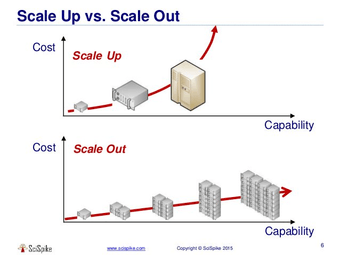
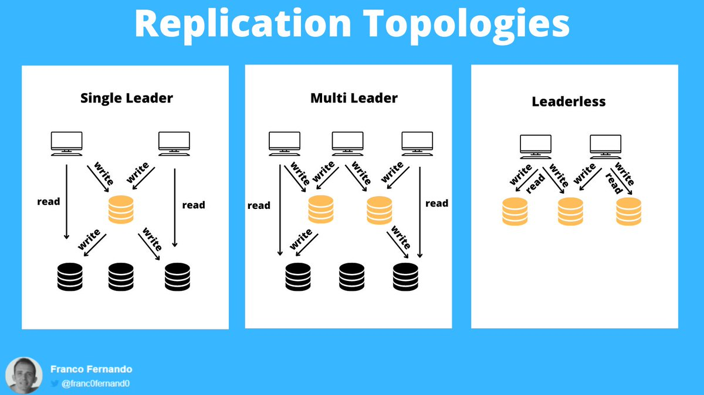

## Why scaling up doesn't work

1. **The Physical I/O Limit (The "Waiting" Trap)**
	Even if you put the fastest CPU in the world into a single server, the database process will eventually start **waiting**.
	*   **Disk I/O:** Databases (especially storage-intensive ones) often run at 100% CPU utilization but still run slowly because the storage system cannot keep up. In a single monolithic machine, the CPU and storage are connected by a finite bus (PCIe). If the SSD's write speed is 5GB/s, no amount of CPU power will make the database run faster than 5GB/s.
	*   **Network I/O:** If your application needs to handle 100 million requests a second, sending them to a single machine means that machine needs to handle the network stack of 100 million machines. A single NIC (Network Interface Card) has a bandwidth limit.

2. **The Hypervisor Overhead**
	If you are using virtualization (AWS EC2, Azure VMs, VMware), scaling up is constrained by the virtualization layer.
	*   **Paravirtualization Drivers:** To make VMs perform like bare metal, hypervisors require specific drivers. There is a constant battle between the Guest OS and the Host for control of hardware.
	*   **vCPU/DRAM Allocation:** Cloud providers limit you to specific configurations (e.g., "High Memory" instances).
	    *   *Constraint:* You can easily scale out to add 10 shards and let Kubernetes handle the overhead.
	    *   *Constraint:* You cannot "add" RAM to a hypervisor arbitrarily. You must upgrade to an entirely different, much larger instance tier, which might cost 10x more.

3. **Single Point of Failure (SPOF)**
*   **Availability Risk:** Scaling up maximizes the damage of a failure. If you put your entire business on the world’s largest single computer, that computer is a **Single Point of Failure** (SPOF). If a capacitor blows, the router drops, or a hypervisor host fails, **everyone** goes down simultaneously.
*   *Replication Logic:* This is why replication is important. If you have 5 smaller machines, one can fail, and your system stays up.

4. **The Economic Ceiling**
*   There are diminishing returns on hardware. To double the capacity of a single server, you often have to pay for more than double the hardware because server vendors bundle packages (Motherboard + RAM + PSU + Cooling) rather than selling parts incrementally.
*   **Cloud Economics:** In the cloud, there is usually a cap on instance size. You cannot simply purchase "Unlimited RAM." If your database needs 8TB of RAM, you cannot put that in a single VM; you must split it into partitions (sharding) across multiple machines.

---

## Replication

Replication means keeping a copy of the same data on multiple machines that are connected via a network.

- To keep data geographically close to your users (and thus **reduce latency**)
- To allow the system to continue working even if some of its parts have failed (and thus **increase availability**)
- To scale out the number of machines that can serve read queries (and thus **increase read throughput**)

---

## Replication Topologies

Credits: 

There are 3 main databases replication topologies:  
• single leader  
• multi leader  
• leaderless  

### Single leader  
A single database acts as a leader, receiving and applying all write requests.  
All other replicas (followers) can only receive and handle read requests.  
The main benefit of this topology is that it avoids write conflicts.  

**Cons:**
- It performs poorly with write intensive applications since the leader becomes a bottleneck.  
- The system latency increases. The leader can't be close to all the clients and the overall round trip times are higher.  
- It's necessary to implement a failover strategy in case the leader goes down.  
This is quite hard and requires solving problems like:  
- Electing a new leader  
- Being sure that the leader failed  
- Making the replicas agree on the new leader  

---

### Multi Leader  
More databases act as leaders, receiving and applying the write requests.  
The main benefit is that more databases perform writes, being located closer to the clients.  
This increases the write throughput and reduce the latency.  

The drawback is that it's necessary to solve write conflicts.  
Some possible solutions are:  
- attach a timestamp to each write and let followers apply the write with highest value  
- record the conflicts and write application code to let users manually resolve them  
- store all the conflicting writes and return them to the clients when they try to read that data.  
The client is then responsible for solving the conflict and write the data back to the database.  
CouchDB follows this last approach.  

---

### Leaderless  
Each database instance can accept writes and the clients can send writes concurrently.  
As soon a client gets a confirmation from some of the instances, a write is successful.  

**Pros:**
- The benefit is that failures are tolerated easily without failover strategies.  

**Cons:**
- But having no leader handling any kind of synchronization causes other issues.  
- First of all if some writes fail, the corresponding instances will have staled data.  
- To deal with this, clients need to read data from several instances concurrently.  
- The instances then return their data with a kind of version number.  
- The clients can use this number to decide which data to keep and which to discard.  
- But how to update instances having staled data?  

There are 2 common techniques.  
- read repair: when a client detects that a read data is stale, it sends a write request with the correct data  
- background process: a background process take care of periodically synchronize all database instances.  

---
