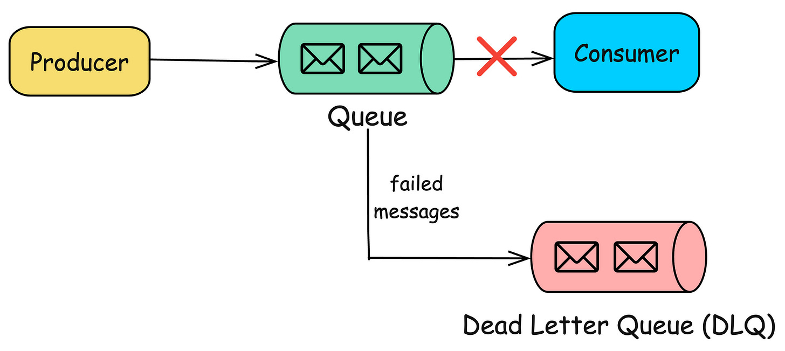
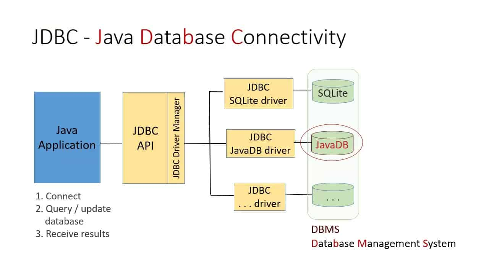
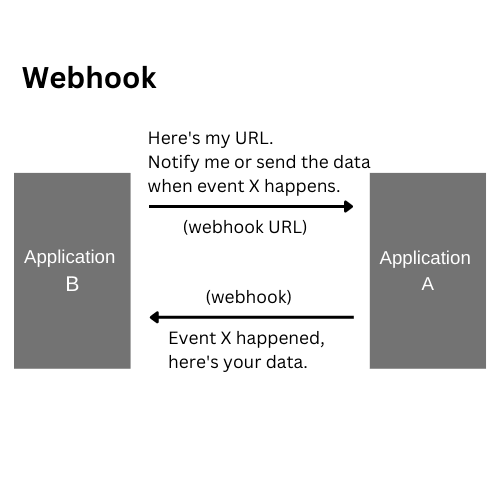

## Data Migration Basics

* Moving data between systems (e.g., SQL Server → Snowflake) is rarely seamless

* Schema differences almost always exist

* Best practice:

  * Test with **sample data first**
  * Validate schema compatibility before full migration

* Bulk transfer is preferred over row-by-row transfer

  * Use **object storage (S3, GCS)** as an intermediate layer

* Biggest challenge is often **pipeline migration**, not just data movement

* Use automated tools whenever possible

**Example**
Migrating a user table:

* Source: `VARCHAR(255)`
* Target: `TEXT`
* Edge case: encoding differences → corrupted strings if not tested

---

## Streaming Ingestion: Core Challenges


### Schema Evolution

* Event schemas change over time:

  * New fields added
  * Fields removed
  * Data types changed

* Risks:

  * Downstream pipeline failures
  * Silent data corruption

**Mitigation**

* Use schema registry with versioning
* Maintain communication with upstream teams
* Use dead-letter queues for failures

**Example**
IoT event:

```json
{ "temp": 22 }
```

After firmware update:

```json
{ "temp": 22, "humidity": 60 }
```

Older consumers may break if not handled

---

### Late-Arriving Data

* Event time ≠ ingestion time

* Causes:

  * Network delays
  * Device offline periods

* Problem:

  * Incorrect analytics if using ingestion time

**Solution**

* Define cutoff window (e.g., accept events within 10 minutes delay)

**Example**

* Sensor sends reading at 10:00
* Arrives at 10:05
* Without correction → wrong time-series analysis

---

### Ordering and Multiple Delivery

* Distributed systems →

  * Messages may arrive out of order
  * Messages may be duplicated

* Delivery semantics:

  * At-least-once (duplicates possible)

**Example**

* Payment event processed twice → double charge if not idempotent

---

### Replay

* Ability to reprocess historical data

* Supported by systems like Kafka, Kinesis

**Use case**

* Bug fix → reprocess last 24 hours of events

---

### Time to Live (TTL)

* Defines how long events are retained

Trade-offs:

* Too short → data loss
* Too long → backlog and latency

**Examples**

* Pub/Sub: up to 7 days
* Kinesis: up to 365 days
* Kafka: configurable (even indefinite) 

---

### Message Size Constraints

* Systems limit event size

Examples:

* Kinesis: 1 MB
* Kafka: default 1 MB (configurable higher) 

**Design implication**

* Large payloads → store in object storage, send reference

---

### Error Handling and Dead-Letter Queues

* Failed events must not block pipeline

* Solution: **Dead-letter queue (DLQ)**

  * Store problematic events separately

  * “Good” events → consumer
  * “Bad” events → DLQ 

*Src: blog.algomaster.io*

**Example**

* Invalid JSON → routed to DLQ
* Later fixed and reprocessed

---

### Push vs Pull Consumption

* Pull:

  * Consumer fetches data (Kafka, Kinesis)
* Push:

  * System sends data to consumer (Pub/Sub, RabbitMQ)

**Trade-off**

* Pull = more control
* Push = simpler integration

---

### Location and Latency

* Ingest close to data source → lower latency

Trade-off:

* Cross-region data transfer cost

**Example**

* IoT data processed in same region vs sent globally

---

## Ways to Ingest Data


### Direct Database Connections (JDBC/ODBC)


*Src: networkencyclopedia.com*

Key ideas:

* JDBC → JVM-based portability
* ODBC → OS-dependent drivers

Limitations:

* Poor support for nested data
* Row-based transfer inefficient

**Optimization**

* Parallel queries (but increases DB load)

---

### Change Data Capture (CDC)

---

#### Batch CDC

* Uses timestamps (e.g., `updated_at`)

Limitation:

* Only captures latest state

**Example**

* Bank account updated 5 times → only final balance captured

---

#### Continuous CDC

* Captures every change as an event

* Uses database logs

**Example**

* PostgreSQL WAL → streamed to Kafka

---

#### CDC vs Replication

* Synchronous replication:

  * Strong consistency
  * Used for read replicas

* Asynchronous CDC:

  * Flexible
  * Supports analytics pipelines

---

## APIs as Data Sources

* No standardization → high engineering effort

Trends:

* API client libraries
* Managed connectors
* Data sharing platforms

**Advice**

* Avoid building connectors from scratch unless necessary

---

## Message Queues vs Streams

* Message queue:

  * Transient
  * Event disappears after consumption

* Stream:

  * Persistent log
  * Supports replay

* As seen in *diagram on page 12*:

  * Multiple producers → consumers → recombined → new stream 

---

## Managed Data Connectors

* Prebuilt connectors (SaaS or OSS)

Capabilities:

* CDC
* Scheduling
* Monitoring

**Key idea**

* Avoid reinventing ingestion plumbing

---

## Object Storage as Ingestion Layer

* Highly scalable
* Secure
* Supports any file type

**Use cases**

* Intermediate storage
* Cross-team sharing

---

## File Formats

---

### CSV (Problematic)

* No schema
* Ambiguous delimiters
* No support for nested data

---

### Modern Formats

* Parquet, Avro, ORC, Arrow

Advantages:

* Schema included
* Efficient
* Supports nested data

**Example**

* JSON stored as nested structure in Parquet

---

## Legacy and Practical Methods

---

### EDI (Email, Flash Drives)

* Still used in real-world systems

**Improvement**

* Automate ingestion from email → object storage

---

### Shell and CLI

* Used for scripting ingestion workflows

---

### SSH, SCP, SFTP

* Secure data transfer methods

* Common in enterprise pipelines

---

## Webhooks (Reverse APIs)

  
*Src: bannerbear.com*

* Data provider sends events

* Consumer must expose endpoint

  * Webhook → serverless → stream → storage 

Challenges:

* Hard to maintain
* Requires robust architecture

---

## Web Scraping

* Extract data from websites

Challenges:

* Legal risks
* Fragile HTML structure
* Maintenance overhead

---

## Large-Scale Data Transfer

* For 100TB+:

  * Use physical devices (Snowball, Snowmobile)

**Insight**

* “Truck > Internet” at massive scale

---

## Data Sharing

* Access data without copying

* Read-only datasets from providers

Trade-off:

* No ownership
* Access can be revoked

---

## Key Takeaways

* Ingestion is not just data movement—it impacts:

  * Schema
  * Storage
  * Processing

* Trade-offs exist everywhere:

  * Latency vs cost
  * Flexibility vs complexity

* Prefer:

  * Managed solutions
  * Object storage
  * Streaming systems with replay

* Always design for:

  * Failures
  * Schema changes
  * Scalability

---

## References
1. Chapter 7 Fundamentals of Data Engineering   