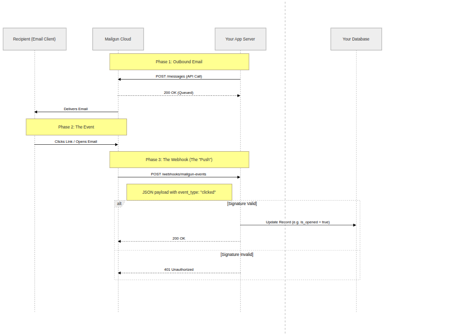
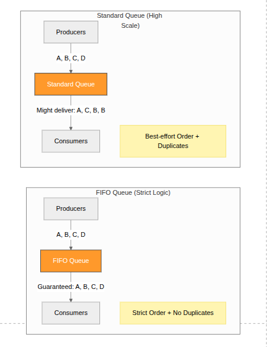
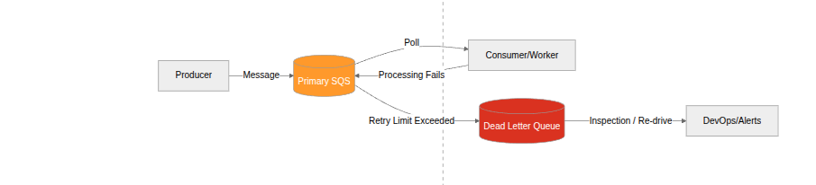
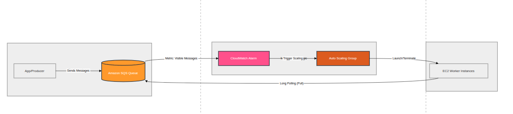
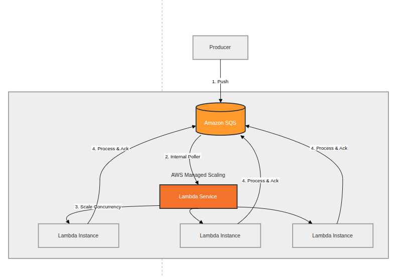

## Key AWS services

###  Compute (The Brains)

- **EC2 (Elastic Compute Cloud):** Virtual servers where you have full control over the OS and software.
- **Lambda:** A "serverless" service that runs your code only when triggered, so you don't manage any servers.
- **Elastic Beanstalk:** The "easy button" for deploying web apps; you upload code, and AWS handles the infrastructure.

### Storage (The Memory)
- **S3 (Simple Storage Service):** Unlimited "buckets" to store files like images, videos, or backups.
- **EBS (Elastic Block Store):** Hard drives for your EC2 instances that persist even if the server is stopped.
- **Glacier:** Low-cost storage for long-term archiving (data you rarely need to look at).

###  Databases (The Ledger)
- **RDS (Relational Database Service):** Managed SQL databases (MySQL, PostgreSQL) that handle their own patching and backups.
- **DynamoDB:** A super-fast NoSQL database designed for massive scale and simple key-value lookups.

### Networking & Content (The Roads)
- **VPC (Virtual Private Cloud):** Your own private, isolated section of the AWS network to launch resources.
- **CloudFront:** A Global Content Delivery Network (CDN) that makes your website load fast by caching it near your users.
- **Route 53:** A highly available Domain Name System (DNS) service that connects URLs to your resources.

### Security & Monitoring (The Guards)
- **IAM (Identity and Access Management):** The central hub where you define **who** can access **which** AWS resources.
- **CloudWatch:** A monitoring dashboard that tracks performance metrics and sends alerts if things break.

---
## Webhooks
A **webhook** is a method of augmenting or altering the behavior of a [web page](https://en.wikipedia.org/wiki/Web_page "Web page") or [web application](https://en.wikipedia.org/wiki/Web_application "Web application") with custom [callbacks](https://en.wikipedia.org/wiki/Callback_\(computer_programming\) "Callback (computer programming)"). These callbacks may be maintained, modified, and managed by third-party users who need not be affiliated with the originating website or application.
Example: Mail tracking service

## Simple Queue Service (SQS)

**Amazon SQS** is a fully managed message queuing service that lets you send, store, and receive messages between software components at any volume, without losing messages or requiring other services to be available

---
### 1. Standard Queue
The **default** queue type — built for maximum throughput.  
**Key characteristics:**  
- **Unlimited throughput** — supports a nearly unlimited number of transactions per second  
- **At-least-once delivery** — a message may be delivered more than once (duplicates possible)  
- **Best-effort ordering** — messages are generally delivered in order, but not guaranteed  
- **Use when:** order doesn't matter and your application can handle duplicate messages (e.g., sending notifications, log ingestion, background jobs)  

---

### 2. FIFO Queue (First-In-First-Out)

Built for scenarios where **order and exactly-once processing** matter.  
**Key characteristics:**  
- **Limited throughput** — up to 3,000 messages/sec with batching, or 300 messages/sec without  
- **Exactly-once processing** — duplicates are eliminated via deduplication IDs  
- **Strict ordering** — messages are delivered and processed in the exact order they were sent  
- **Message groups** — supports `MessageGroupId` to allow parallel processing of independent message streams within the same queue  
- **Use when:** order is critical — e.g., financial transactions, order processing, inventory updates  
---

### Side-by-Side Comparison

| Feature            | Standard Queue | FIFO Queue          |
| ------------------ | -------------- | ------------------- |
| Throughput         | Unlimited      | Up to 3,000 msg/sec |
| Message ordering   | Best-effort    | Strict (guaranteed) |
| Delivery           | At-least-once  | Exactly-once        |
| Duplicate handling | Possible       | Prevented           |
| Naming             | Any name       | Must end in `.fifo` |
| Cost               | Lower          | Slightly higher     |

---
### Quick Rule of Thumb

> Use **Standard** when you need **speed and scale**. Use **FIFO** when you need **accuracy and order**.

### Dead letter queue

A **Amazon SQS Dead Letter Queue (DLQ)** is an Amazon Simple Queue Service feature that captures messages that could not be successfully processed by a consuming application.  

---

## Load balancing using SQS

### SQS + cloudwatch

Think of Amazon SQS as:
> A pressure gauge   
- Few messages → low pressure → fewer workers  
- Many messages → high pressure → spawn more workers  

Use:  
- Amazon EC2 Auto Scaling  
- CloudWatch metric:   
    👉 `ApproximateNumberOfMessagesVisible`  
---

#### How it works:
1. Messages pile up in SQS  
2. Metric increases  
3. Auto Scaling policy triggers  
4. More EC2 instances (consumers) launch  
5. They start polling SQS  
---

#### Example Scaling Rule

- If messages > 1000 → add 5 instances  
- If messages < 100 → remove instances  

---

### SQS + serverless

Use:
- AWS Lambda + SQS trigger
---

#### How it works:
- SQS automatically invokes Lambda  
- AWS handles scaling **for you**  
- Concurrency increases as queue grows  
---
#### Key Details:
- Each batch of messages → one Lambda invocation  
- Scaling is near real-time  
- You can control:  
    - Batch size  
    - Max concurrency  
---

