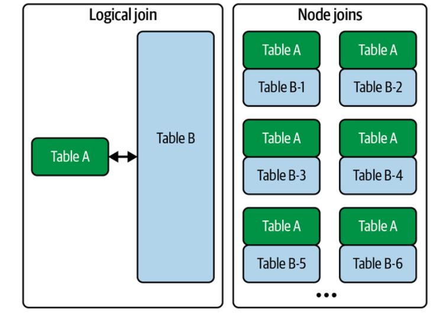
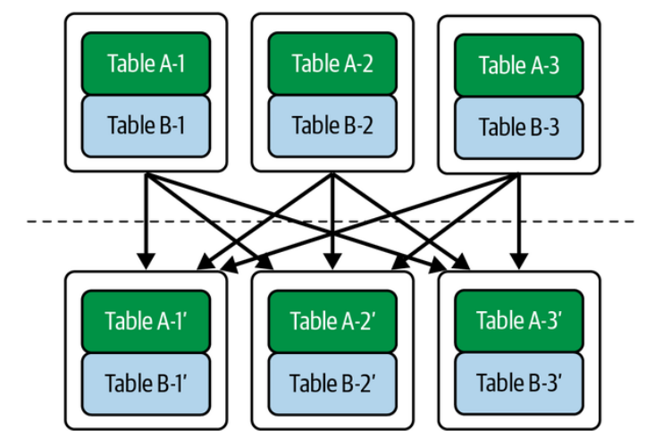

# Transformation Layer: Joins

## Joins
### Local Joins (Single Machine)

Local joins assume:

both datasets exist on one machine

Example:

```sql
SELECT *
FROM orders o
JOIN users u
ON o.user_id = u.id
```

Example tables:

Orders

|order_id|user_id|price|
|---|---|---|
|1|101|50|
|2|102|80|

Users

|id|country|
|---|---|
|101|India|
|102|USA|

Result

|order_id|user_id|country|price|
|---|---|---|---|
|1|101|India|50|

---

#### Common Local Join Algorithms

##### Nested Loop Join

For each row in A, scan B.

```
for a in A:
   for b in B:
       if a.key == b.key:
           emit(a,b)
```

Cost:

```
What is the time complexity?

```

Slow but simple.

---

##### Hash Join (most common)

Steps:
- Build hash table for smaller table
- Probe with larger table

```
Build phase
users_hash[user_id] = row

Probe phase
for order in orders:
    lookup user
```

Complexity:

```
What is the time complexity?


```

Used by most databases.

---

##### Sort-Merge Join

Steps:

```
sort(A)
sort(B)
merge
```

Works well when data already sorted.

Used in:
- column stores
- large disk-based joins


---

###  Distributed Joins

In distributed systems:

```
orders → machine 1
users → machine 8
```

Matching keys might be on **different machines**.

Example:

```
orders partition
node1: user=1
node2: user=2
node3: user=3

users partition
node1: user=2
node2: user=1
node3: user=3
```

The system must **move data across machines**.

Network is expensive.

In distributed systems:

```
network cost >> compute cost
```

So the goal is:

```
minimize data movement
```

---

#### Distributed Join Strategies

There are three main strategies:

```
Broadcast join
Partitioned (shuffle) join
Locality-aware joins (pre-partitioned)
```

---

#### Broadcast Join (Replicated Join)


Idea:

```
small table → send to every node
```

Example:

```
orders = 1TB
users = 1MB
```

Broadcast users everywhere.

```
Node1: orders partition + users copy
Node2: orders partition + users copy
Node3: orders partition + users copy
```

Then perform **local hash join**.

Diagram:

```
           users (small)
             |
   -------------------------
   |          |            |
Node1       Node2        Node3
orders1     orders2      orders3
```

Advantages:

- very fast
    
- avoids shuffle of big table
    

Disadvantages:

- only works when **one table is small**
    

Typical threshold:

```
< 100MB or < few GB
```

Systems that use this:

- Spark
    
- Presto
    
- BigQuery
    

---

#### Partitioned (Shuffle) Join

Used when **both tables are large**.

Idea:

```
partition both tables using join key
```

Example:

Join key = `user_id`

Partition rule:

```
partition = hash(user_id) % N
```

##### Step 1: Shuffle

Repartition both tables.

Before

```
orders
node1: user1,user4
node2: user2,user3

users
node1: user2,user4
node2: user1,user3
```

After shuffle

```
node1: user1,user3
node2: user2,user4
```

Now each node has **matching keys locally**.

##### Step 2: Local Join

Each node performs local hash join.

Diagram

```
orders ----\
            → shuffle → partition → join
users -----/
```

Advantages:

- works for **large tables**
    

Disadvantages:

- heavy network cost
    
- shuffle is often the **most expensive step** in Spark jobs
    

---

#### Pre-Partitioned Join (Colocated Join)

If datasets are **already partitioned by the join key**, no shuffle is needed.

Example:

Both tables partitioned by `user_id`.

```
Node1
orders(user1,user4)
users(user1,user4)

Node2
orders(user2,user3)
users(user2,user3)
```

Join becomes **purely local**.

Benefits:

```
no network
```

Used in:

- distributed databases
    
- Kafka stream processing
    
- materialized views
    

---

#### Semi Join (Optimization)

Sometimes you don't need full rows.

Example:

```
orders JOIN users
```

But only to check if user exists.

Instead:

```
send only keys
```

Steps:

```
extract user_ids from users
send keys to orders
filter orders
```

Reduces network traffic.

---

### The Real Cost Model

Distributed systems try to minimize:

```
Network transfer
Shuffle size
Disk spill
```

Rough cost ranking:

```
local join        cheapest
broadcast join
shuffle join      most expensive
```

---

#### Real Systems

##### Spark

```
Broadcast Hash Join
Shuffle Hash Join
Sort Merge Join
```

##### BigQuery

```
broadcast joins
distributed shuffle joins
```

##### Presto / Trino

```
replicated join
partitioned join
```

---

### Mental Model

```
Local joins = algorithm problem
Distributed joins = network problem
```

---
## Transformation patterns

- How do we **update existing records**?
- How do we **remove records**?
- How do we **change schema without breaking pipelines**?

---

### Big Idea: Mutable vs Immutable Data

Traditional databases assume:

```
records can be updated in-place
```

Example:

```sql
UPDATE users
SET country = 'India'
WHERE id = 101
```

But many **modern data systems prefer immutable data**.

Instead of changing rows:

```
append new records representing changes
```

Example log:

| id  | country | version |
| --- | ------- | ------- |
| 101 | USA     | 1       |
| 101 | India   | 2       |

Latest version wins.

---

### Update Patterns

There are three common update strategies in data systems.

```
1. In-place updates
2. Append-only updates
3. Upserts / Merge updates
```

---

#### In-place Updates

This is the **traditional database model**.
Example:
```
old row overwritten
```

Before

| id  | country |
| --- | ------- |
| 101 | USA     |

After

| id  | country |
| --- | ------- |
| 101 | India   |

Characteristics

- simple
- efficient for OLTP systems
- harder to audit history

Used in:
- PostgreSQL
- MySQL
- transactional databases

Problem for analytics:

```
history disappears
```

---

#### Append-only Updates

Modern data pipelines often use **append-only logs**.

Instead of modifying data:

```
new version is appended
```

Example:

| id  | country | timestamp |
| --- | ------- | --------- |
| 101 | USA     | 10:00     |
| 101 | India   | 12:00     |

Queries use:

```
latest record
```

Advantages
- immutable
- reproducible pipelines    
- easy lineage

Disadvantages
- more storage
- requires compaction

Used in:
- event streams
- data lakes
- CDC pipelines

---

#### Upserts (Merge Updates)

Upsert means:

```
update if exists
insert if not
```

Example SQL:

```sql
MERGE INTO users t
USING updates s
ON t.id = s.id
WHEN MATCHED THEN UPDATE
WHEN NOT MATCHED THEN INSERT
```

Common in data warehouses:

- Snowflake    
- BigQuery
- Delta Lake

Used heavily in:

```
incremental transformations
```

Example pipeline:

```
new_orders → merge into fact_orders
```

---

#### Slowly Changing Dimensions (Important Pattern)

In analytics, updates often follow **SCD patterns**.
Common types:

 **Type 1**

Overwrite value.

```
USA → India
```

History lost.

---

**Type 2**

Create new row with version.

Example:

| user | country | start | end  |
| ---- | ------- | ----- | ---- |
| 101  | USA     | 2022  | 2024 |
| 101  | India   | 2024  | null |

History preserved.

Very common in **data warehouses**.

---

### Delete Patterns

Deletes are also tricky in analytical systems.

Three patterns are common.

```
1. Hard delete
2. Soft delete
3. Tombstone records
```

---

#### Hard Delete

Record removed entirely.

Example:

```sql
DELETE FROM users WHERE id=101
```

Row disappears.

Problems:

- breaks reproducibility
    
- destroys history
    

Mostly used in OLTP systems.

---

#### Soft Delete

Instead of deleting, mark row as deleted.

Example:

|id|name|deleted|
|---|---|---|
|101|Alice|true|

Queries filter:

```
WHERE deleted = false
```

Advantages

- recoverable
    
- audit trail
    

---

#### Tombstone Records

Common in **log-based systems**.

A delete is represented as a **special event**.

Example log:

|id|action|
|---|---|
|101|create|
|101|update|
|101|delete|

The "delete" record acts as a **tombstone**.

Used in:

- Kafka streams
    
- log compaction systems
    
- CDC pipelines

---

### Schema Updates (Schema Evolution)

Schema changes are inevitable.

Example change:

```
users(id, name)
```

→

```
users(id, name, country)
```

The challenge is:

```
old data still exists
```

Systems must handle **multiple schema versions simultaneously**.

---

#### Backward vs Forward Compatibility

#### Backward compatibility

New system reads old data.

Example

Old record:

```
{id:101, name:"Alice"}
```

New schema:
```
{id, name, country}
```

Country defaults to NULL.

---

#### Forward compatibility

Old system reads new data.

Example:

New record

```
{id:101, name:"Alice", country:"India"}
```

Old system ignores `country`.

---

#### Schema Evolution Strategies

Common approaches.

---

### Additive changes (safest)

Add new column.

```
ALTER TABLE users ADD country
```

Works well with compatibility.

---

### Deprecation

Columns marked unused before removal.

Process:

```
add new column
update pipelines
remove old column
```

---

### Versioned Schemas

Store schema version.
Example:

| version | schema          |
| ------- | --------------- |
| 1       | id,name         |
| 2       | id,name,country |

Used in:
- Avro
- Protobuf   
- Kafka schema registry
    

---

### Typical Data Engineering Strategy

Modern pipelines follow this philosophy:

```
raw data immutable
transformations reproducible
schemas evolve gradually
```

A typical pipeline might look like:

```
raw_events (append-only)
     ↓
clean_events
     ↓
modeled_tables
     ↓
analytics_tables
```

Updates and deletes are handled during **transformation layers**, not by mutating raw data.

---

### Mental Model

Think of modern data systems as:

```
history of changes
```
instead of:
```
current state only
```

Updates, deletes, and schema changes are just **events in the history of the dataset**.

---

## References
1. Chapter 8 Fundamentals of Data Engineering